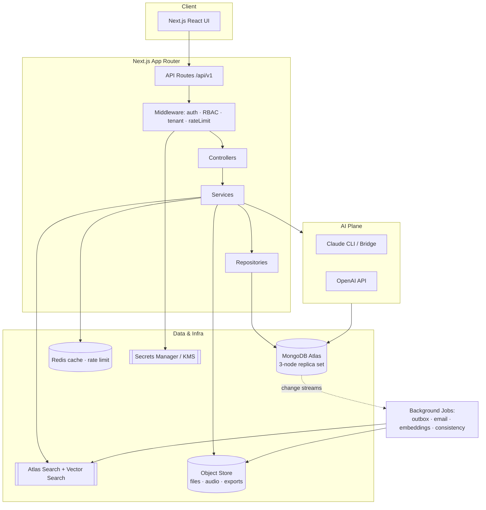
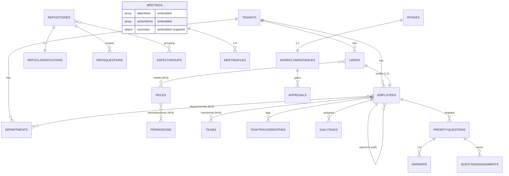
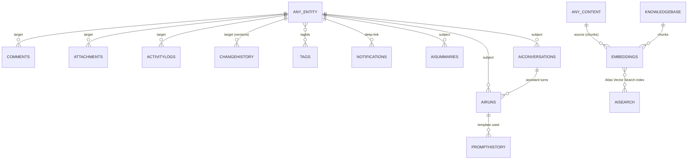
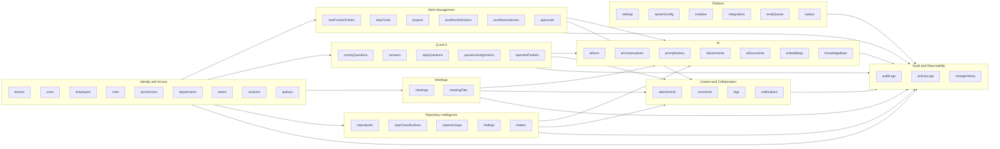

# Governance Workbench — MongoDB Data Architecture & Implementation Blueprint

> **Status:** Draft for review · **Type:** Technical Design Document (planning only) · **Owner:** Architecture
> **Author role:** Principal Software Architect / Senior MongoDB Database Architect / Backend Lead
> **Scope:** Design and roadmap for migrating Governance Workbench storage from the current
> SQLite + GitHub-markdown model to **MongoDB Atlas**. This document is a blueprint.
> **No application code, no collections, no migration scripts, and no schema changes are created by this document.**
> The existing application continues to run on its current storage until this plan is approved.

---

## 0. Executive Summary

### 0.1 What we have today

The Governance Workbench is a **Next.js 15 (App Router, TypeScript)** application (ported from an
earlier Flask app) that currently persists data in **two** places:

1. **A local SQLite database** (`better-sqlite3`, file `governance.db`) holding ~24 transactional
   tables — intake workflow, meetings, team-member files/questions/answers, repository
   classification, AI runs and exchanges, etc. This file is **git-ignored runtime state** and, on
   Vercel, lives in ephemeral `/tmp` — meaning **it is not durable in production**.
2. **GitHub markdown files** committed straight to the repository (`Governance_Files/**`) via the
   GitHub Contents API — Task Tracker entries, Priority-Question answers, Meeting notes, and the
   `_GOVERNANCE` corpus. These are human-readable records but are **unqueryable, unindexed, and
   have no referential integrity**.

Domain metadata (companies, employees, departments, repository categories, aspect groups) is
**hard-coded in `lib/config.ts`**, not stored in any database.

### 0.2 Why we are migrating

| Pain today | Consequence |
|---|---|
| SQLite on Vercel is ephemeral (`/tmp`) | Data loss on redeploy / cold start; not production-grade |
| Markdown-in-Git as a datastore | No queries, no indexes, no aggregation, no integrity, hand-parsed |
| Employees/departments in source code | Every org change is a code deploy |
| No unified audit trail | Git history ≠ per-field change history; SQLite has none |
| Two sources of truth (SQLite + Git) | Drift, duplication, reconciliation cost |
| No RBAC, no real auth | "App is open — no login gate" (per README) |
| No AI-native storage | Claude/OpenAI outputs scattered across tables and files |

### 0.3 What we are building

A single, durable, **MongoDB Atlas**-backed data platform that is:

- **Multi-tenant from day one** (the code already carries a `company` discriminator everywhere).
- **Schema-validated** with JSON Schema `$jsonSchema` validators on every collection.
- **Audit-complete** — every document carries created/updated/deleted actor + timestamp + version,
  with an append-only change history.
- **AI-ready** — first-class collections for prompts, conversations, AI documents, and Atlas Vector
  Search embeddings enabling RAG and semantic search over the governance corpus.
- **Clean-architecture backend** — controller → service → repository → model layering behind the
  existing Next.js API routes.
- **Designed for 5+ years** — extensible module registry, soft delete, tagging, notifications,
  workflow/approvals, and reporting/analytics baked into the model.

### 0.4 Guiding principle

> **We are not "converting markdown to documents."** We are modeling the governance *domain* —
> people, work, questions, meetings, decisions, AI reasoning, and audit — as a normalized,
> indexed, validated document database, then treating markdown/Git as an optional export target,
> not the system of record.

---

## Table of Contents

1. [Overall Database Architecture](#1-overall-database-architecture)
2. [Collection Design Standard](#2-collection-design-standard)
3. [Collections (Full Catalog)](#3-collections-full-catalog)
4. [Relationship Diagram](#4-relationship-diagram)
5. [Index Strategy](#5-index-strategy)
6. [Schema Validation](#6-schema-validation)
7. [Backend Folder Structure](#7-backend-folder-structure)
8. [API Design](#8-api-design)
9. [Migration Strategy](#9-migration-strategy)
10. [Security](#10-security)
11. [Audit System](#11-audit-system)
12. [AI-Ready Design](#12-ai-ready-design)
13. [Performance](#13-performance)
14. [Coding Standards](#14-coding-standards)
15. [Production Best Practices](#15-production-best-practices)
16. [Future Scalability](#16-future-scalability)
17. [ER & Architecture Diagrams](#17-er--architecture-diagrams)
18. [Final Implementation Roadmap](#18-final-implementation-roadmap)

---

## 1. Overall Database Architecture

### 1.1 Design philosophy

Seven principles govern every decision in this document:

1. **Model the domain, not the files.** Collections represent business entities (Employee, Task,
   Question, Meeting, Decision), not the markdown artifacts that currently happen to store them.
2. **Reference across aggregates, embed within them.** Use embedding for data that is owned by,
   bounded in size with, and always read alongside its parent. Use references (ObjectId) across
   independent lifecycles and unbounded/growing relationships.
3. **Tenant isolation is structural, not incidental.** Every business document carries `tenantId`
   (and, where relevant, `orgId`). This is the seam for future multi-tenant / multi-org growth that
   the current single-`MView`-company code already anticipates.
4. **Every write is auditable.** No document is created, changed, or removed without recording who,
   when, from where, and what changed.
5. **Soft delete by default.** Governance data is rarely truly deleted; it is retired. Hard deletes
   are a deliberate, privileged, audited operation.
6. **Validate at the edge and at the database.** Zod/DTO validation in the service layer *and*
   `$jsonSchema` validators in MongoDB. Defense in depth.
7. **Design for the query.** Indexes and document shape follow the real access patterns the app
   exhibits today (per-employee lists, per-company filters, status/priority boards, date ranges,
   AI history, full-text search) and the ones we know are coming (analytics, vector search).

### 1.2 Logical architecture

```
┌──────────────────────────────────────────────────────────────────────┐
│  Next.js App (App Router)                                              │
│  ┌────────────┐   ┌──────────────────────────────────────────────┐    │
│  │  React UI  │──▶│  API Routes  (app/api/**/route.ts)            │    │
│  └────────────┘   │   = thin HTTP adapter (controller)            │    │
│                   └───────────────┬──────────────────────────────┘    │
│                                   ▼                                    │
│                   ┌──────────────────────────────────────────────┐    │
│                   │  Service Layer (business logic, transactions) │    │
│                   └───────────────┬──────────────────────────────┘    │
│                                   ▼                                    │
│                   ┌──────────────────────────────────────────────┐    │
│                   │  Repository Layer (data access, one per coll) │    │
│                   └───────────────┬──────────────────────────────┘    │
│                                   ▼                                    │
│   ┌───────────────────────────────────────────────────────────────┐   │
│   │  MongoDB Driver (pooled singleton)  ──▶  MongoDB Atlas         │   │
│   └───────────────────────────────────────────────────────────────┘   │
└──────────────────────────────────────────────────────────────────────┘
        │                         │                          │
        ▼                         ▼                          ▼
  Atlas Cluster            Atlas Search /             Change Streams
  (replica set,            Vector Search index        → notifications,
   backups, PITR)          (AI / RAG / semantic)        activity feed,
                                                        outbox workers
```

### 1.3 Database & cluster topology

- **One logical database** per environment: `governance_dev`, `governance_staging`,
  `governance_prod`. Never share a database across environments.
- **Single Atlas project**, three clusters (or one cluster + separate DBs for non-prod to control
  cost). Production is a **3-node replica set** minimum (`M10`+), enabling failover, backups, and
  Change Streams.
- **Collections are logically grouped** by bounded context (prefix-free names, grouped in docs):
  Identity & Access, Work Management, Q&A, Meetings, Repository Intelligence, AI, Platform,
  Audit & Observability.

### 1.4 Multi-tenancy model

The codebase already threads a `company` key through nearly every table (`company TEXT NOT NULL`,
currently only `"MView"`). We formalize this as **shared-collection, tenant-discriminator**
multi-tenancy — the standard SaaS starting point:

- Every business document has `tenantId: ObjectId` (→ `tenants`). The legacy `company` string maps
  to `tenants.slug` (`"MView"` → the Mineral View tenant).
- Every index that matters is **compound and tenant-prefixed** (`{ tenantId: 1, ... }`) so queries
  are always tenant-scoped and one tenant can never scan another's data.
- The repository base class **injects `tenantId` into every query and every insert** — application
  code cannot accidentally cross tenants.
- This scales to hundreds of tenants on shared infrastructure. If a single tenant later needs
  isolation (compliance, scale), the same document shape supports **promotion to a dedicated
  database/cluster** without a remodel. True per-tenant sharding is a later, optional step
  (§16).

### 1.5 Embedding vs. referencing — the decision rule

| Use **embedding** when… | Use **referencing** when… |
|---|---|
| Child is owned by exactly one parent | Entity is shared/looked up independently (Employee, Tag) |
| Child is always loaded with the parent | Child list is unbounded or grows forever (comments, AI runs, history) |
| Combined document stays well under 16 MB (realistically < ~100 KB) | Child has its own lifecycle, permissions, or audit |
| No need to query the child independently | You need to query, paginate, or index the child on its own |

**Applied decisions:**

- **Meeting → attendees / action-items:** *embedded* arrays. Bounded (a meeting has tens of
  attendees, not thousands), always shown with the meeting, no independent lifecycle. Action-item
  *ownership* references `employees` by id.
- **Task Tracker entry → task body / structured sections:** *embedded*. A task record is a
  self-contained daily/periodic entry.
- **Priority Question ↔ Answers:** *referenced* (separate `answers` collection). Answers arrive over
  time, are authored by different people, get accepted/reviewed independently, and we must query
  "all answers by employee X" — an unbounded, independently-owned relationship.
- **Employee ↔ Department:** *many-to-many via referenced arrays* (`departmentIds` on employee, plus
  a `department_memberships` collection when we need per-membership metadata like source/role).
- **Any entity → Comments / Attachments / Activity / Audit history:** *referenced* generic
  collections (polymorphic `target: { collection, id }`), because they attach to many entity types
  and grow without bound.
- **Any entity → Tags:** tag *definitions* referenced (`tags` collection); tag *assignments* stored
  as an embedded `tagIds: ObjectId[]` on the taggable document for fast filtering.
- **AI outputs (runs, conversations, summaries, embeddings):** *referenced* collections linked back
  to their subject via a polymorphic `subject` pointer — AI history is unbounded and cross-cutting.

### 1.6 Bounded contexts (collection grouping)

| Context | Collections |
|---|---|
| **Identity & Access** | `tenants`, `users`, `employees`, `roles`, `permissions`, `teams`, `departments`, `sessions`, `apiKeys` |
| **Work Management** | `taskTrackerEntries`, `dailyTasks`, `projects`, `workflowDefinitions`, `workflowInstances`, `approvals` |
| **Q & A** | `priorityQuestions`, `answers`, `repoQuestions`, `questionAssignments`, `questionPackets` |
| **Meetings** | `meetings`, `meetingFiles` |
| **Repository Intelligence** | `repositories`, `repoClassifications`, `aspectGroups`, `findings`, `intakes` (workflow) |
| **AI** | `aiRuns`, `aiConversations`, `promptHistory`, `aiSummaries`, `aiDocuments`, `embeddings`, `knowledgeBase` |
| **Content & Collaboration** | `attachments`, `comments`, `tags`, `notifications` |
| **Platform** | `settings`, `systemConfig`, `modules`, `integrations`, `emailQueue`, `outbox` |
| **Audit & Observability** | `auditLogs`, `activityLogs`, `changeHistory` |

---

## 2. Collection Design Standard

Every collection in §3 is specified against this common standard so the whole database is
consistent. This section defines the shared building blocks; §3 shows the per-collection specifics.

### 2.1 Naming conventions

| Element | Convention | Example |
|---|---|---|
| **Collection names** | `camelCase`, **plural** nouns | `priorityQuestions`, `aiRuns` |
| **Field names** | `camelCase` | `createdAt`, `tenantId`, `assigneeId` |
| **Foreign-key fields** | `<entity>Id` (single) / `<entity>Ids` (array) | `employeeId`, `departmentIds` |
| **Booleans** | `is`/`has` prefix | `isDeleted`, `hasAttachments` |
| **Enums** | `UPPER_SNAKE` string values | `status: "OPEN"`, `priority: "HIGH"` |
| **Dates** | BSON `Date` (UTC), field suffix `At` | `meetingAt`, `deletedAt` |
| **Money/large numbers** | `Decimal128` (never float) | — (future finance modules) |
| **Slugs / stable keys** | `slug`, lowercase, `_`-separated | `memberKey: "ajay_landge"` |

> **Migration note:** The legacy code uses `snake_case` keys and slug member keys
> (`member_key = "ajay_landge"`). We keep the **slug values** (they are stable natural keys and
> preserve links to existing markdown) but standardize the **field names** to `camelCase`.

### 2.2 The base document (every business collection embeds this)

```jsonc
{
  "_id": ObjectId,                 // Mongo primary key
  "tenantId": ObjectId,            // → tenants   (REQUIRED on all business docs)

  // ----- Audit envelope (see §11) -----
  "createdAt": Date,               // REQUIRED, default now
  "createdBy": ObjectId,           // → users  (REQUIRED; system actor for jobs)
  "updatedAt": Date,               // REQUIRED, default now
  "updatedBy": ObjectId,           // → users
  "deletedAt": Date | null,        // soft delete tombstone (null = live)
  "deletedBy": ObjectId | null,
  "isDeleted": false,              // denormalized flag for cheap filtering + partial index
  "version": 1,                    // optimistic-concurrency / schema-evolution counter
  "changeSource": "UI",            // UI | API | MIGRATION | AI | SYSTEM | INTEGRATION

  // ----- Cross-cutting optional -----
  "tagIds": [ObjectId],            // → tags        (optional)
  "schemaVersion": 1,              // document-shape version for safe evolution
  "metadata": { }                  // open bag for forward-compatible extension
}
```

Two reusable rules make this cheap:

- A **repository base class** stamps `createdAt/By`, `updatedAt/By`, `version`, and `changeSource`
  automatically. Feature code never writes these by hand.
- `metadata` (a permissive sub-document) is the **pressure-relief valve**: new, not-yet-promoted
  fields land here without a validator change, and graduate to first-class fields once stable.

### 2.3 Standard sub-documents (reused everywhere)

```jsonc
// Polymorphic pointer — lets generic collections attach to any entity
"target": { "collection": "meetings", "id": ObjectId }

// Actor snapshot — denormalized for display without a join
"actor": { "userId": ObjectId, "displayName": "Ryan Cochran", "role": "ADMIN" }

// AI subject pointer — what an AI artifact is "about"
"subject": { "collection": "employees", "id": ObjectId, "field": "profile" }

// Money (future) — never floats
"amount": { "value": Decimal128, "currency": "USD" }
```

### 2.4 Per-collection specification template

Each collection in §3 is documented with: **Purpose · Context · Key fields (type / required /
default / validation) · Relationships · Embedding decision · Indexes · Lifecycle & soft delete ·
Future extensibility · Document example.** To keep the document readable, the **audit envelope
from §2.2 is implied on every business collection** and only called out where it differs.

### 2.5 Lifecycle & soft-delete strategy (global)

- **Create** → `isDeleted=false`, `version=1`, audit stamped.
- **Update** → `version++`, `updatedAt/By` refreshed, a `changeHistory` entry appended (§11).
- **Soft delete** → set `isDeleted=true`, `deletedAt/By`; document remains for audit/restore.
  All default reads add `{ isDeleted: false }` (enforced in the repository base, not per query).
- **Restore** → clear the tombstone, `version++`, audited.
- **Hard delete** → privileged, rare, audited, and generally only for GDPR/right-to-erasure or true
  junk. Guarded behind `SUPER_ADMIN` + explicit confirmation.
- **Retention/TTL** → transient collections (`sessions`, `notifications`, `activityLogs`,
  `outbox`, `emailQueue`, ephemeral `aiRuns` logs) use **TTL indexes** (§5) to expire automatically.

---
## 3. Collections (Full Catalog)

> The audit envelope (§2.2) is present on **every** business collection and is not repeated below.
> Types use BSON names. `req` = required, `opt` = optional. Slugs preserve legacy natural keys.

### 3.A Identity & Access

#### 3.A.1 `tenants`
- **Purpose:** Top-level customer/organization boundary. Formalizes the legacy `company` string.
- **Key fields:**
  | Field | Type | Req | Default | Notes / Validation |
  |---|---|---|---|---|
  | `slug` | string | req | — | unique, lowercase (`"mview"`); maps legacy `"MView"` |
  | `nameFull` | string | req | — | `"Mineral View (MVest LLC)"` |
  | `status` | enum | req | `ACTIVE` | `ACTIVE\|SUSPENDED\|ARCHIVED` |
  | `settings` | object | opt | `{}` | tenant-level feature flags, timezone (`Asia/Kolkata`) |
  | `plan` | enum | opt | `STANDARD` | future billing tiers |
- **Relationships:** parent of nearly everything (1-to-many via `tenantId`).
- **Indexes:** `{ slug: 1 }` unique.
- **Lifecycle:** never hard-deleted; `ARCHIVED` instead.

#### 3.A.2 `users`
- **Purpose:** Authentication identity + login credentials (replaces SQLite `users`). Separate from
  `employees` (a person = one `user` auth identity + one `employee` HR/governance profile).
- **Key fields:**
  | Field | Type | Req | Default | Notes |
  |---|---|---|---|---|
  | `email` | string | req | — | unique per tenant, lowercased, validated pattern |
  | `username` | string | opt | — | legacy login; unique per tenant if present |
  | `passwordHash` | string | req* | — | Argon2id/bcrypt; *req unless SSO-only |
  | `authProviders` | array | opt | `[]` | `[{provider:"google", subject:"..."}]` future SSO |
  | `displayName` | string | opt | — | |
  | `employeeId` | ObjectId | opt | — | → `employees` (1-to-1) |
  | `roleIds` | ObjectId[] | req | `[]` | → `roles` (RBAC) |
  | `status` | enum | req | `ACTIVE` | `ACTIVE\|INVITED\|DISABLED\|LOCKED` |
  | `lastLoginAt` | Date | opt | — | |
  | `mfaEnabled` | bool | opt | `false` | future |
  | `failedLoginCount` | int | opt | `0` | lockout / rate-limit support |
- **Indexes:** `{tenantId:1, email:1}` unique; `{tenantId:1, username:1}` unique sparse.
- **Security:** `passwordHash` never projected to clients; consider client-side field-level
  encryption for `email` if required (§10).

#### 3.A.3 `employees`
- **Purpose:** The governance/HR profile of a team member — the heart of the app. Replaces the
  **hard-coded `TEAM_MEMBER_PROFILES` in `lib/config.ts`** and the `team-member-*.md` corpus.
- **Key fields:**
  | Field | Type | Req | Default | Notes |
  |---|---|---|---|---|
  | `memberKey` | string | req | — | slug natural key (`"ajay_landge"`) — **preserves legacy links**; unique per tenant |
  | `fullName` | string | req | — | `"Ajay Landge"` |
  | `email` | string | opt | — | |
  | `title` | string | opt | — | `"Business Development & Digital Marketing Executive"` |
  | `purpose` | string | opt | — | one-line role summary |
  | `departmentIds` | ObjectId[] | req | `[]` | → `departments` (M-to-M) |
  | `reportsToId` | ObjectId | opt | — | → `employees` (self-ref hierarchy) |
  | `finalAuthorityId`| ObjectId | opt | — | → `employees` (governance owner) |
  | `repoAccess` | string[] | opt | `[]` | repo slugs the member owns/works |
  | `status` | enum | req | `ACTIVE` | `ACTIVE\|INACTIVE\|OFFBOARDED` |
  | `profile` | object | opt | `{}` | rich profile: priorities, surfaces, work-completed (from markdown) |
  | `reviewCadence` | string | opt | — | `"Monthly"` |
  | `userId` | ObjectId | opt | — | → `users` (1-to-1 back-reference) |
- **Embedding:** the narrative profile (`snapshot`, `priorities`, `workCompleted`) is embedded in
  `profile` (bounded, always read with the employee). Files/questions/tasks are **referenced**.
- **Indexes:** `{tenantId:1, memberKey:1}` unique; `{tenantId:1, departmentIds:1}`;
  `{tenantId:1, status:1}`; text index on `fullName, title, purpose`.
- **Future:** skills, capacity, cost center, location — add under `profile`/first-class as needed.

#### 3.A.4 `roles` & 3.A.5 `permissions`
- **Purpose:** RBAC. `permissions` is the catalog of atomic capabilities; `roles` bundle them.
- **`permissions` fields:** `key` (`"tasks:create"`, unique), `description`, `module`, `action`
  (`CREATE\|READ\|UPDATE\|DELETE\|APPROVE\|EXPORT`), `resource`.
- **`roles` fields:** `key` (`ADMIN`), `name`, `description`, `permissionKeys: string[]`,
  `isSystem` (bool — protects built-ins `SUPER_ADMIN\|ADMIN\|MANAGER\|EMPLOYEE\|VIEWER`),
  `tenantId` (null for global system roles).
- **Relationships:** `users.roleIds → roles`; `roles.permissionKeys → permissions.key`.
- **Indexes:** `roles {tenantId:1, key:1}` unique; `permissions {key:1}` unique.
- **Future:** attribute-based / fine-grained conditions (`conditions` object) for row-level rules.

#### 3.A.6 `departments`
- **Purpose:** Org departments (`DATA_SCIENCE`, `MARKETING`, `PLATFORM_INFRASTRUCTURE`, …) — moves
  the config-driven `DEPARTMENT_ARCHITECTURE` into data.
- **Fields:** `key` (`"DATA_SCIENCE"`, unique per tenant), `name`, `description`, `leadEmployeeId`,
  `parentDepartmentId` (hierarchy), `repoScopes: string[]`.
- **Indexes:** `{tenantId:1, key:1}` unique.

#### 3.A.7 `teams` *(optional/foundational)*
- **Purpose:** Cross-department working groups / aspect ownership. Backs `ASPECT_GROUP_RULES`.
- **Fields:** `key`, `name`, `description`, `memberIds: ObjectId[]`, `leadId`, `repoScopes`.
- **Relationship:** M-to-M `employees ↔ teams`.

#### 3.A.8 `sessions`
- **Purpose:** Server-side login sessions / refresh tokens (durable replacement for "no login gate").
- **Fields:** `userId`, `tokenHash` (never raw), `ip`, `userAgent`, `createdAt`, `expiresAt`,
  `revokedAt`.
- **Indexes:** `{userId:1}`; **TTL** `{expiresAt:1}` → auto-expiry.

#### 3.A.9 `apiKeys` *(future)*
- **Purpose:** Programmatic access for integrations/agents.
- **Fields:** `name`, `prefix`, `keyHash`, `scopes: string[]`, `createdBy`, `expiresAt`,
  `lastUsedAt`, `revokedAt`, `rateLimitTier`.
- **Indexes:** `{prefix:1}` unique; TTL optional on `expiresAt`.

### 3.B Work Management

#### 3.B.1 `taskTrackerEntries`
- **Purpose:** The Task Tracker — periodic per-employee work logs. Replaces
  `Governance_Files/task_tracker/*.md`.
- **Key fields:**
  | Field | Type | Req | Default | Notes |
  |---|---|---|---|---|
  | `employeeId` | ObjectId | req | — | → `employees` |
  | `employeeName` | string | req | — | denormalized snapshot for lists |
  | `entryDate` | Date | req | — | the work date (IST-aware, stored UTC) |
  | `title` | string | opt | `"Task Tracker"` | |
  | `bodyMarkdown` | string | opt | — | original free text (round-trippable to markdown) |
  | `sections` | array | opt | `[]` | structured `[{heading, items:[...]}]` parsed from body |
  | `status` | enum | req | `SUBMITTED` | `DRAFT\|SUBMITTED\|REVIEWED` |
  | `githubRef` | object | opt | — | `{path, sha, commitUrl}` if also exported to Git |
- **Embedding:** `sections` embedded (bounded, always shown with the entry).
- **Indexes:** `{tenantId:1, employeeId:1, entryDate:-1}`; `{tenantId:1, entryDate:-1}`;
  text index on `bodyMarkdown, title`.

#### 3.B.2 `dailyTasks`
- **Purpose:** Fine-grained, individually-trackable task items (checkable to-dos), distinct from the
  Task Tracker *log*. Supports future boards/assignments.
- **Key fields:** `employeeId`, `assigneeId`, `title` (req), `description`, `status`
  (`TODO\|IN_PROGRESS\|BLOCKED\|DONE\|CANCELLED`), `priority` (`LOW\|MEDIUM\|HIGH\|URGENT`),
  `dueAt`, `completedAt`, `projectId`, `taskTrackerEntryId` (optional link), `parentTaskId`
  (subtasks), `order` (int, manual sort).
- **Indexes:** `{tenantId:1, assigneeId:1, status:1, dueAt:1}`; `{tenantId:1, status:1, priority:1}`;
  `{tenantId:1, projectId:1}`.

#### 3.B.3 `projects` *(optional)*
- **Purpose:** Group tasks/work under initiatives. Fields: `key`, `name`, `description`, `status`,
  `ownerId`, `departmentId`, `startAt`, `endAt`, `repoScopes`.

#### 3.B.4 `workflowDefinitions` / `workflowInstances` / `approvals`
- **Purpose:** Generalize the existing **intake → gates → advance** workflow (SQLite `intake`,
  `gate`, `workflow_event`) into a reusable engine (§16).
- **`workflowDefinitions`:** `key`, `name`, `stages:[{key,name,order,entryGates}]`, `moduleId`.
- **`workflowInstances`:** `definitionId`, `subject` (polymorphic → e.g. `intakes`), `currentStage`,
  `stageHistory:[{stage,enteredAt,actorId,note}]`, `status`, `blocker`.
- **`approvals`:** `subject` (polymorphic), `gateKey`, `status` (`NOT_STARTED\|PENDING\|APPROVED\|REJECTED`),
  `approverId`, `decidedAt`, `note`.
- **Indexes:** instances `{tenantId:1, status:1, currentStage:1}`; approvals `{tenantId:1, subject.id:1}`.

### 3.C Question & Answer

#### 3.C.1 `priorityQuestions`
- **Purpose:** Priority questions posed to team members. Replaces the question side of Priority
  Questions + SQLite `team_member_questions`.
- **Key fields:**
  | Field | Type | Req | Default | Notes |
  |---|---|---|---|---|
  | `questionCode` | string | req | — | stable code, unique per tenant (legacy `question_code`) |
  | `title` | string | opt | — | |
  | `bodyMarkdown` | string | req | — | the question text |
  | `shortQuestion` | string | opt | — | |
  | `targetEmployeeId`| ObjectId | opt | — | who it's for |
  | `priority` | enum | req | `MEDIUM` | `LOW\|MEDIUM\|HIGH\|URGENT` |
  | `status` | enum | req | `OPEN` | `NEW\|OPEN\|ANSWERED\|ACCEPTED\|CLOSED` |
  | `source` | enum | req | `MANUAL` | `MANUAL\|AI_GENERATED\|FILE\|MEETING` |
  | `sourceRef` | object | opt | — | polymorphic origin `{collection,id,section}` |
  | `generatedBy` | string | opt | — | `"claude"\|"openai"\|"manual"` |
  | `answerCount` | int | opt | `0` | denormalized rollup |
- **Relationship:** 1-to-many → `answers`; assigned via `questionAssignments`.
- **Indexes:** `{tenantId:1, questionCode:1}` unique; `{tenantId:1, targetEmployeeId:1, status:1}`;
  `{tenantId:1, priority:1, updatedAt:-1}`; text on `bodyMarkdown, title, shortQuestion`.

#### 3.C.2 `answers`
- **Purpose:** Answers to priority/repo questions. Replaces the `*_answers/*.md` files and SQLite
  `team_member_question_answers`. **Referenced** (not embedded) — unbounded, independently authored,
  independently accepted.
- **Key fields:** `questionId` (req → `priorityQuestions`/`repoQuestions` via `questionKind`),
  `questionKind` (`PRIORITY\|REPO`), `answerMarkdown` (req), `answeredById` (→ employees),
  `answeredByName` (snapshot), `answeredAt`, `matchConfidence` (`LOW\|MEDIUM\|HIGH`),
  `parsedBy` (`manual\|claude\|openai`), `acceptedBy` (ObjectId), `acceptedAt`,
  `sourceFileId` (→ attachments/meetingFiles).
- **Indexes:** `{tenantId:1, questionId:1, answeredAt:-1}`; `{tenantId:1, answeredById:1, answeredAt:-1}`.

#### 3.C.3 `repoQuestions`
- **Purpose:** Repository-scoped questions (SQLite `repo_questions`). Same shape family as priority
  questions but keyed to a repository.
- **Extra fields:** `repositoryId`/`repoName`, `bodyMarkdown`, `answerMarkdown` (last accepted),
  `primaryAssigneeId`, `reviewNote`, `reviewedById`.
- **Indexes:** `{tenantId:1, questionCode:1}` unique; `{tenantId:1, repoName:1}`;
  `{tenantId:1, priority:1, updatedAt:-1}`.

#### 3.C.4 `questionAssignments`
- **Purpose:** Who owns which question (SQLite `question_assignment`). Kept as a thin join so
  assignment history and notes are first-class.
- **Fields:** `questionId`, `questionKind`, `assigneeId`, `note`, `assignedById`.
- **Indexes:** `{tenantId:1, questionId:1}` unique.

#### 3.C.5 `questionPackets`
- **Purpose:** Versioned exported bundles of questions for a member (SQLite
  `team_member_question_packets`).
- **Fields:** `employeeId`, `packetVersion` (int), `questionIds: ObjectId[]`, `exportedFileId`,
  `exportedById`, `exportedAt`.
- **Indexes:** `{tenantId:1, employeeId:1, packetVersion:1}` unique.

### 3.D Meetings

#### 3.D.1 `meetings`
- **Purpose:** Meetings with embedded attendees & action items. Replaces `Governance_Files/Meetings/*.md`
  + SQLite `meetings`/`meeting_attendees`/`meeting_action_items`.
- **Key fields:**
  | Field | Type | Req | Default | Notes |
  |---|---|---|---|---|
  | `title` | string | req | — | |
  | `meetingType` | enum | req | `OTHER` | `STANDUP\|REVIEW\|GOVERNANCE\|ONE_ON_ONE\|OTHER` |
  | `organizerId` | ObjectId | opt | — | → employees |
  | `meetingAt` | Date | req | — | scheduled/occurred time |
  | `note` | string | opt | — | |
  | `attendees` | array | opt | `[]` | **embedded** `[{employeeId?, externalName?, externalEmail?, attended:bool, followUpDone:bool, followUpNote?}]` |
  | `actionItems` | array | opt | `[]` | **embedded** `[{ownerId?, description, status, dueAt?}]` |
  | `summary` | object | opt | — | `{text, status, engine, generatedAt}` (AI summary inline snapshot) |
  | `priorityQuestionIds` | ObjectId[] | opt | `[]` | questions generated from meeting |
  | `fileIds` | ObjectId[] | opt | `[]` | → `meetingFiles` |
- **Embedding rationale:** attendees/action-items are bounded and always shown with the meeting.
  The AI summary keeps a denormalized snapshot inline **and** a full record in `aiSummaries`.
- **Indexes:** `{tenantId:1, meetingAt:-1}`; `{tenantId:1, meetingType:1, meetingAt:-1}`;
  `{tenantId:1, "attendees.employeeId":1}`; text on `title, note, summary.text`.

#### 3.D.2 `meetingFiles`
- **Purpose:** Uploaded meeting artifacts (notes, transcripts, **voice memos** `.webm`). Specializes
  `attachments` for meetings; keeps transcript/analysis linkage.
- **Fields:** `meetingId`, `originalFilename`, `storageRef` (object store key — see §3.G note),
  `mimeType`, `sizeBytes`, `kind` (`NOTES\|TRANSCRIPT\|AUDIO\|OTHER`), `transcriptText`,
  `analysisRunId` (→ `aiRuns`).
- **Indexes:** `{tenantId:1, meetingId:1}`.

### 3.E Repository Intelligence

#### 3.E.1 `repositories`
- **Purpose:** Canonical registry of code repositories (currently discovered from GitHub at runtime;
  promote to a first-class entity). Fields: `name` (unique per tenant), `owner`, `defaultBranch`,
  `githubId`, `aspectGroupId`, `departmentIds`, `lastSyncedAt`, `isArchived`.
- **Indexes:** `{tenantId:1, name:1}` unique.

#### 3.E.2 `repoClassifications`
- **Purpose:** Classification of a repo into a category (SQLite `repo_classification`).
- **Key fields:** `repositoryId`/`repoName` (req), `observedPurpose`, `proposedCategory` (enum from
  `REPO_CATEGORIES`), `confidence` (`LOW\|MEDIUM\|HIGH`), `canonicalStatus`, `evidence`,
  `findingId`, `questionId`, `approvalStatus` (`PENDING\|APPROVED\|REJECTED`).
- **Indexes:** `{tenantId:1, repoName:1}` unique; `{tenantId:1, approvalStatus:1}`;
  `{tenantId:1, proposedCategory:1}`.

#### 3.E.3 `aspectGroups`
- **Purpose:** Named groupings of repos by concern (`ASPECT_GROUP_RULES`). Fields: `name`,
  `description`, `repoNames: string[]`, `repoIds: ObjectId[]`.

#### 3.E.4 `findings`
- **Purpose:** Review findings / drift observations (SQLite `finding_reviews`, `repo_understanding`).
  Fields: `findingCode`, `repoName`, `departmentKey`, `title`, `bodyMarkdown`, `severity`,
  `decision` (`OPEN\|REVIEWED\|ACCEPTED\|REJECTED`), `reviewerId`, `reviewedAt`, `questionId`.
- **Indexes:** `{tenantId:1, findingCode:1}` unique; `{tenantId:1, repoName:1}`;
  `{tenantId:1, decision:1}`.

#### 3.E.5 `intakes` (workflow subject)
- **Purpose:** The intake pipeline (SQLite `intake` + `intake_file` + `gate` + `workflow_event` +
  `link`). Modeled as a workflow subject (§3.B.4) with **embedded** files/links/gate-snapshots and
  referenced `workflowInstanceId`.
- **Key fields:** `company`→`tenantId`, `employeeId`, `sourceType`, `aiEngines: string[]`, `note`,
  `stage`, `blocker`, `files:[{filename, storageRef, sizeBytes}]`, `links:[{kind, ref}]`,
  `gates:[{name, status, approverId, decidedAt, note}]`, `workflowInstanceId`.
- **Indexes:** `{tenantId:1, stage:1, updatedAt:-1}`; `{tenantId:1, employeeId:1}`.

### 3.F AI

#### 3.F.1 `aiRuns`
- **Purpose:** Every discrete AI invocation (Claude CLI / OpenAI) — replaces SQLite `ai_run`,
  `team_member_file_analysis`, `team_member_question_ai_run`. A single, uniform AI-execution log.
- **Key fields:** `engine` (`CLAUDE\|OPENAI`), `model`, `actionType`
  (`SUMMARY\|ANALYSIS\|GENERATE_QUESTIONS\|PARSE_ANSWERS\|CHAT\|CLASSIFY\|FOLLOW_UP`),
  `subject` (polymorphic → what it acted on), `status` (`PENDING\|RUNNING\|SUCCEEDED\|FAILED`),
  `startedAt`, `completedAt`, `promptText`, `outputText`, `outputStorageRef`, `tokenUsage`
  (`{input,output}`), `costUsd` (Decimal128), `errorText`, `conversationId`, `promptHistoryId`.
- **Indexes:** `{tenantId:1, subject.collection:1, subject.id:1, startedAt:-1}`;
  `{tenantId:1, engine:1, status:1}`; `{tenantId:1, startedAt:-1}`.
- **Lifecycle:** long-term retained for audit; raw `promptText/outputText` may be offloaded to object
  storage (`outputStorageRef`) with the DB keeping metadata + embeddings.

#### 3.F.2 `aiConversations`
- **Purpose:** Multi-turn chats (file chat, member-question chat, repo-question chat, AI exchanges).
  Replaces SQLite `ai_exchange` and the various `*_chat` routes.
- **Fields:** `title`, `subject` (polymorphic context), `participants` (`[{engine|userId}]`),
  `messages: [{role:(USER|ASSISTANT|SYSTEM), engine?, content, contentRef?, tokenUsage?, createdAt, runId?}]`
  (embedded, capped — overflow rolls to `aiRuns`), `status`, `lastMessageAt`.
- **Embedding decision:** messages embedded while a conversation is bounded (typical governance
  chats are short); a `messageCount`/size guard rolls very long threads into referenced `aiRuns`.
- **Indexes:** `{tenantId:1, subject.id:1, lastMessageAt:-1}`; `{tenantId:1, lastMessageAt:-1}`.

#### 3.F.3 `promptHistory`
- **Purpose:** Versioned catalog of prompt templates actually used (reproducibility, prompt
  engineering, A/B). Fields: `key`, `version`, `template`, `variables: string[]`, `engine`,
  `actionType`, `isActive`, `createdBy`.
- **Indexes:** `{tenantId:1, key:1, version:-1}`.

#### 3.F.4 `aiSummaries`
- **Purpose:** First-class store of AI-generated summaries (meeting summaries, file summaries,
  employee digests) — the "AI Generated Summaries" module.
- **Fields:** `subject` (polymorphic → meeting/file/employee), `summaryText`, `bulletPoints: string[]`,
  `engine`, `model`, `runId`, `generatedAt`, `status` (`DRAFT\|FINAL`), `embeddingId`.
- **Indexes:** `{tenantId:1, subject.collection:1, subject.id:1, generatedAt:-1}`.

#### 3.F.5 `aiDocuments`
- **Purpose:** AI-**generated** long-form documents (drafts, reports, generated governance docs) —
  the future "AI Generated Documents" module. Distinct from human-authored governance files.
- **Fields:** `title`, `docType`, `bodyMarkdown`/`storageRef`, `subject`, `sourceRunId`,
  `status` (`DRAFT\|IN_REVIEW\|PUBLISHED\|ARCHIVED`), `reviewedById`, `embeddingId`, `version`.
- **Indexes:** `{tenantId:1, docType:1, status:1}`; text on `title, bodyMarkdown`.

#### 3.F.6 `embeddings`
- **Purpose:** Vector embeddings for **Atlas Vector Search** — the RAG/semantic-search backbone
  (§12). One document per embedded chunk.
- **Key fields:** `source` (polymorphic → any content: governance file, answer, summary, meeting,
  employee profile), `chunkIndex`, `text` (the chunk), `embedding` (`double[]`, e.g. 1536/3072 dims),
  `model` (`"text-embedding-3-large"` etc.), `dims`, `tokenCount`, `contentHash` (dedupe/staleness).
- **Indexes:** **Atlas Vector Search index** on `embedding` (cosine); plus `{tenantId:1, source.collection:1, source.id:1}`
  and `{contentHash:1}`.
- **Note:** vector index is an **Atlas Search index**, defined separately from normal indexes.

#### 3.F.7 `knowledgeBase`
- **Purpose:** Curated, retrievable knowledge units powering RAG answers and semantic search over
  the `_GOVERNANCE` corpus (playbooks, non-negotiables, decision log).
- **Fields:** `title`, `slug`, `category`, `bodyMarkdown`, `sourceRef` (origin file/decision),
  `tags`, `isPublished`, `embeddingIds: ObjectId[]`, `version`.
- **Indexes:** `{tenantId:1, slug:1}` unique; `{tenantId:1, category:1}`; text on `title, bodyMarkdown`.

### 3.G Content & Collaboration

> **Binary storage note:** MongoDB documents cap at 16 MB. **Binary files (uploads, `.webm` voice
> memos, transcripts, exports) are stored in an object store** (Atlas Data Lake / S3 / GCS) and only
> *referenced* from `attachments`/`meetingFiles` via `storageRef`. GridFS is a fallback if an object
> store is undesirable, but object storage is the recommended production choice.

#### 3.G.1 `attachments`
- **Purpose:** Generic file registry for any entity (team-member files, intake files, exports).
  Replaces SQLite `team_member_files` + scattered `saved_path`.
- **Fields:** `target` (polymorphic owner), `originalFilename`, `storageRef`
  (`{bucket,key,provider}`), `mimeType`, `sizeBytes`, `filePurpose` (enum), `checksum`,
  `uploadedById`, `aiPreference` (`CLAUDE\|OPENAI`), `analysisRunIds: ObjectId[]`.
- **Indexes:** `{tenantId:1, target.collection:1, target.id:1}`; `{tenantId:1, checksum:1}` (dedupe).

#### 3.G.2 `comments`
- **Purpose:** Threaded comments on any entity. Fields: `target` (polymorphic), `parentId`
  (threading), `bodyMarkdown`, `authorId`, `mentions: ObjectId[]`, `resolvedAt`, `reactions`.
- **Indexes:** `{tenantId:1, target.collection:1, target.id:1, createdAt:1}`.

#### 3.G.3 `tags`
- **Purpose:** Central tag/label catalog (the legacy `team_member_department_tags` becomes a typed
  tag). Fields: `key`, `label`, `color`, `scope` (`GLOBAL\|DEPARTMENT\|CUSTOM`), `usageCount`.
- **Indexes:** `{tenantId:1, key:1}` unique.
- **Usage:** taggable docs carry `tagIds: ObjectId[]` (see §2.2) for fast `$in` filtering.

#### 3.G.4 `notifications`
- **Purpose:** In-app notifications feed. Fields: `recipientId`, `type`, `title`, `body`,
  `target` (deep-link), `channel` (`IN_APP\|EMAIL\|WEBHOOK`), `readAt`, `sentAt`,
  `priority`, `expiresAt`.
- **Indexes:** `{tenantId:1, recipientId:1, readAt:1, createdAt:-1}`; **TTL** `{expiresAt:1}`.

### 3.H Platform

#### 3.H.1 `settings`
- **Purpose:** Tenant/user-scoped settings (replaces `local_settings.json` + `openai_settings`).
  Fields: `scope` (`TENANT\|USER`), `ownerId` (tenant or user), `key`, `value` (mixed),
  `isSecret` (bool → value encrypted).
- **Indexes:** `{tenantId:1, scope:1, ownerId:1, key:1}` unique.

#### 3.H.2 `systemConfig`
- **Purpose:** Global, non-tenant platform configuration (feature flags, engine defaults, model
  names). Single well-known keys. Fields: `key` (unique), `value`, `description`, `updatedBy`.

#### 3.H.3 `modules`
- **Purpose:** The **module registry** enabling "future governance modules without redesign."
  Declares each functional module (Employees, Task Tracker, Meetings, …, and new ones) with its
  metadata, enablement, permissions, and navigation. New modules are **data, not a schema change**.
- **Fields:** `key`, `name`, `description`, `isEnabled`, `navOrder`, `requiredPermissionKeys`,
  `collections: string[]` (which collections it owns), `version`.
- **Indexes:** `{tenantId:1, key:1}` unique.

#### 3.H.4 `integrations`
- **Purpose:** External integration config/state (GitHub, Gmail/member-hub, OpenAI, remote Claude
  bridge). Fields: `provider` (`GITHUB\|GMAIL\|OPENAI\|CLAUDE_BRIDGE`), `status`, `config`
  (non-secret), `secretRef` (→ secrets manager, never raw), `lastSyncAt`, `scopes`.
- **Indexes:** `{tenantId:1, provider:1}` unique.

#### 3.H.5 `emailQueue` & 3.H.6 `outbox` *(future/foundational)*
- **`emailQueue`:** durable outbound email jobs — `to`, `template`, `data`, `status`
  (`QUEUED\|SENT\|FAILED`), `attempts`, `sendAfter`, `sentAt`. TTL on delivered rows.
- **`outbox`:** transactional outbox for reliable event publishing (change → notification / webhook /
  search-index). `eventType`, `payload`, `status`, `processedAt`. Enables the event-driven fan-out
  in §16 without dual-write bugs.

### 3.I Audit & Observability

#### 3.I.1 `auditLogs`
- **Purpose:** Immutable, security-grade audit trail of **who did what** (authz decisions, logins,
  privileged actions, exports, hard deletes). Append-only.
- **Fields:** `actor` (snapshot), `action`, `target` (polymorphic), `outcome`
  (`SUCCESS\|DENIED\|ERROR`), `ip`, `userAgent`, `changeSource`, `at`, `context` (object).
- **Indexes:** `{tenantId:1, at:-1}`; `{tenantId:1, "actor.userId":1, at:-1}`;
  `{tenantId:1, action:1, at:-1}`. No TTL (retain per compliance policy) — optionally archived.

#### 3.I.2 `activityLogs`
- **Purpose:** User-facing activity feed ("Ryan answered Q123", "Ajay submitted a task"). Lighter
  than audit; drives dashboards/notifications. Fields: `actor`, `verb`, `target`, `summary`, `at`.
- **Indexes:** `{tenantId:1, at:-1}`; `{tenantId:1, target.id:1, at:-1}`; **TTL** optional (e.g. 180d).

#### 3.I.3 `changeHistory`
- **Purpose:** Per-document field-level change log (previous → new values), enabling point-in-time
  reconstruction and "version N" restore. The engine behind §11.
- **Fields:** `target` (polymorphic doc), `version`, `changedBy`, `changedAt`, `changeSource`,
  `diff: [{field, from, to}]`, `snapshot` (optional full doc snapshot every K versions).
- **Indexes:** `{tenantId:1, target.collection:1, target.id:1, version:-1}`.

### 3.J Recommended additional collections

| Collection | Why recommended |
|---|---|
| `webhookDeliveries` | Reliable inbound/outbound webhook audit (GitHub events, etc.) |
| `rateLimitCounters` | Durable, distributed rate-limit buckets (or Redis; §10) — TTL-based |
| `savedViews` / `filters` | User-saved board/filter presets as the UI grows |
| `reportSnapshots` | Pre-computed analytics rollups for dashboards (§16) |
| `importJobs` | Track migration/import batches, status, and reconciliation (§9) |
| `featureFlags` | If flags outgrow `systemConfig` |

---
## 4. Relationship Diagram

### 4.1 Relationship inventory

| Relationship | Type | Modeled as | Why |
|---|---|---|---|
| `tenants` → everything | 1-to-many | reference (`tenantId`) | Tenant isolation seam |
| `users` ↔ `employees` | 1-to-1 | reference both ways (`employeeId`/`userId`) | Auth identity vs. governance profile are separate concerns |
| `users` → `roles` | many-to-many | ref array (`roleIds`) | A user can hold several roles |
| `roles` → `permissions` | many-to-many | ref array (`permissionKeys`) | Roles bundle atomic permissions |
| `employees` ↔ `departments` | many-to-many | ref array (`departmentIds`) | Members span departments (real data shows 3–8 each) |
| `employees` ↔ `teams` | many-to-many | ref array (`memberIds`) | Aspect/working groups |
| `employees` → `employees` | 1-to-many (self) | ref (`reportsToId`) | Reporting hierarchy |
| `employees` → `taskTrackerEntries` | 1-to-many | reference | Unbounded per-person log |
| `employees` → `dailyTasks` | 1-to-many | reference | Assignable, filterable to-dos |
| `priorityQuestions` → `answers` | 1-to-many | reference | Answers arrive over time, independently owned |
| `priorityQuestions` ↔ `employees` | many-to-one (target) + M-to-M (assignments) | ref + `questionAssignments` | Targeting vs. ownership differ |
| `repoQuestions` → `repositories` | many-to-one | reference | Questions scoped to a repo |
| `meetings` → attendees | 1-to-many | **embedded** | Bounded, always co-read |
| `meetings` → action items | 1-to-many | **embedded** | Bounded, co-read; owner references employee |
| `meetings` → `meetingFiles` | 1-to-many | reference | Binaries live in object store |
| `repositories` → `repoClassifications` | 1-to-1 (current) | reference | One canonical classification per repo |
| `repositories` ↔ `aspectGroups` | many-to-many | ref arrays | Grouping by concern |
| `intakes` → `workflowInstances` | 1-to-1 | reference | Workflow engine subject |
| `workflowInstances` → `approvals` | 1-to-many | reference | Gate decisions |
| any entity → `aiRuns`/`aiSummaries`/`aiConversations` | 1-to-many | reference (polymorphic `subject`) | AI history is cross-cutting, unbounded |
| any content → `embeddings` | 1-to-many | reference (polymorphic `source`) | Chunked vectors for RAG |
| any entity → `comments`/`attachments`/`activityLogs`/`changeHistory` | 1-to-many | reference (polymorphic `target`) | Generic, cross-entity, unbounded |
| any entity ↔ `tags` | many-to-many | ref array (`tagIds`) on doc + `tags` catalog | Fast filter + central catalog |

### 4.2 Text ER overview

```
                         ┌────────────┐
                         │  tenants   │  (root of multi-tenancy)
                         └─────┬──────┘
             ┌─────────────────┼───────────────────────────────┐
             ▼                 ▼                                ▼
      ┌────────────┐    ┌────────────┐                   ┌────────────┐
      │   users    │1─1│ employees  │*───────* departments│ departments│
      │  (roleIds) │    │(reportsTo↺)│*───────* teams      └────────────┘
      └─────┬──────┘    └─────┬──────┘
         *  │                 │ 1
            ▼ (M:M)           ├───────────────* taskTrackerEntries
      ┌────────────┐          ├───────────────* dailyTasks
      │   roles    │*───*perms ├──────────────* priorityQuestions ─1──*─ answers
      └────────────┘          │                        │*                 
                              │                         └─*─ questionAssignments
                              ├───────────* meetings (⊂ attendees, actionItems)
                              │                 └─1──* meetingFiles
                              └───────────* attachments / comments / notifications

   repositories ─1─1─ repoClassifications        intakes ─1─1─ workflowInstances ─1─*─ approvals
        │*                                              
        └─* aspectGroups        findings, repoQuestions ─*─1─ repositories

   ── AI plane (polymorphic subject/source pointers to any entity above) ──
   aiRuns · aiConversations · promptHistory · aiSummaries · aiDocuments · embeddings · knowledgeBase

   ── Cross-cutting (polymorphic target pointers to any entity above) ──
   auditLogs · activityLogs · changeHistory · comments · attachments · tags · notifications
```

### 4.3 Why polymorphic pointers (not per-type collections)

Generic capabilities (comments, attachments, audit, AI artifacts, embeddings) attach to **many**
entity types. Rather than `meetingComments`, `taskComments`, … we use one `comments` collection with
`target: { collection, id }`. Benefits: one code path, one index shape, trivially extends to new
modules. Trade-off: no DB-level FK; integrity is enforced in the repository/service layer and
verified by periodic consistency jobs (§6.5).

---

## 5. Index Strategy

**Golden rules:** (1) every business query is **tenant-prefixed**; (2) follow the **ESR order**
(Equality → Sort → Range) when composing compound keys; (3) index for the queries the app actually
runs, not speculatively; (4) use **partial indexes** to exclude soft-deleted docs and keep indexes
lean; (5) put text/vector search in **Atlas Search**, not overloaded btree indexes.

### 5.1 Core indexes by need

| Need | Collection(s) | Index | Rationale |
|---|---|---|---|
| **Employee lookup** | `employees` | `{tenantId:1, memberKey:1}` **unique** | Primary natural-key fetch; preserves legacy slug links |
| Employee by dept | `employees` | `{tenantId:1, departmentIds:1, status:1}` | Multikey; roster filtered by department |
| **Status boards** | `dailyTasks`, `priorityQuestions`, `repoQuestions`, `intakes` | `{tenantId:1, status:1, updatedAt:-1}` | Kanban/status columns sorted by recency |
| **Priority** | `priorityQuestions`, `repoQuestions`, `dailyTasks` | `{tenantId:1, priority:1, updatedAt:-1}` | Priority-sorted queues |
| **Dates / ranges** | `taskTrackerEntries`, `meetings`, `dailyTasks` | `{tenantId:1, entryDate:-1}` / `{tenantId:1, meetingAt:-1}` | Date-range + recency scans (ESR: range last) |
| Per-employee work log | `taskTrackerEntries` | `{tenantId:1, employeeId:1, entryDate:-1}` | "This person's entries, newest first" |
| Answers by question | `answers` | `{tenantId:1, questionId:1, answeredAt:-1}` | Load a question's answers |
| Answers by author | `answers` | `{tenantId:1, answeredById:1, answeredAt:-1}` | "All answers by X" (impossible today in markdown) |
| **Meeting history** | `meetings` | `{tenantId:1, meetingAt:-1}`, `{tenantId:1, "attendees.employeeId":1}` | Timeline + "meetings a person attended" |
| **AI history** | `aiRuns` | `{tenantId:1, "subject.collection":1, "subject.id":1, startedAt:-1}` | "All AI activity about entity X" |
| AI cost/usage | `aiRuns` | `{tenantId:1, engine:1, startedAt:-1}` | Usage & cost reporting |
| Conversations | `aiConversations` | `{tenantId:1, "subject.id":1, lastMessageAt:-1}` | Chat threads for a subject |
| **Repository Classification** | `repoClassifications` | `{tenantId:1, repoName:1}` **unique**, `{tenantId:1, approvalStatus:1}`, `{tenantId:1, proposedCategory:1}` | Canonical row, review queue, category rollups |
| Question codes | `priorityQuestions`, `repoQuestions` | `{tenantId:1, questionCode:1}` **unique** | Idempotent upsert, dedupe of `Q-AI-####` |
| Assignments | `questionAssignments` | `{tenantId:1, questionId:1}` **unique** | One owner record per question |
| Attachments by owner | `attachments` | `{tenantId:1, "target.collection":1, "target.id":1}` | Files for any entity |
| Dedupe uploads | `attachments` | `{tenantId:1, checksum:1}` | Duplicate detection |
| Comments feed | `comments` | `{tenantId:1, "target.collection":1, "target.id":1, createdAt:1}` | Threaded display |
| Notifications | `notifications` | `{tenantId:1, recipientId:1, readAt:1, createdAt:-1}` | Unread-first feed |
| Audit queries | `auditLogs` | `{tenantId:1, at:-1}`, `{tenantId:1, "actor.userId":1, at:-1}`, `{tenantId:1, action:1, at:-1}` | Forensic lookups |
| Change history | `changeHistory` | `{tenantId:1, "target.collection":1, "target.id":1, version:-1}` | Version reconstruction |
| Uniqueness (identity) | `users` | `{tenantId:1, email:1}` **unique**; `{tenantId:1, username:1}` unique sparse | Login integrity |
| Settings | `settings` | `{tenantId:1, scope:1, ownerId:1, key:1}` **unique** | Deterministic setting fetch |

### 5.2 Full-text search

- **Baseline:** MongoDB **text indexes** on `bodyMarkdown/title` fields of `priorityQuestions`,
  `repoQuestions`, `taskTrackerEntries`, `knowledgeBase`, `aiDocuments`, `meetings` for keyword
  search (a strict upgrade over grepping markdown files).
- **Production search:** **Atlas Search** (Lucene) indexes for relevance ranking, fuzzy matching,
  autocomplete, and faceting across governance content — one `default` search index per searchable
  collection. Recommended over plain text indexes once search UX matters.

### 5.3 Vector / semantic search

- **Atlas Vector Search index** on `embeddings.embedding` (kNN, cosine), with `tenantId`,
  `source.collection`, and `source.id` as **filter fields** so semantic search is tenant- and
  scope-constrained. This powers RAG and "find similar" (§12).

### 5.4 Compound-index design notes (ESR)

For a board query like `find({tenantId, status:'OPEN'}).sort({priority:-1, updatedAt:-1})`, the
index is `{tenantId:1, status:1, priority:-1, updatedAt:-1}` — Equality (`tenantId`, `status`),
then Sort (`priority`, `updatedAt`). Avoid one index per field; a few well-ordered compound indexes
beat many single-field ones. Cap total indexes per collection (~8–12) to protect write throughput.

### 5.5 TTL indexes (auto-expiry)

| Collection | TTL field | Suggested retention | Purpose |
|---|---|---|---|
| `sessions` | `expiresAt` | on expiry | Session cleanup |
| `notifications` | `expiresAt` | 30–90 days | Feed hygiene |
| `activityLogs` | `at` (+partial) | 180 days | Bounded activity feed (audit kept separately) |
| `outbox` | `processedAt` | 7 days | Post-dispatch cleanup |
| `emailQueue` | `sentAt` | 30 days | Delivered-mail cleanup |
| `aiRuns` (ephemeral logs only) | `expiresAt` | optional | If raw logs offloaded to object store |
| `rateLimitCounters` | `expiresAt` | seconds–minutes | Rolling windows |

> **Never** TTL `auditLogs`, `changeHistory`, or business records — those are governed by retention
> policy and archived, not silently expired.

### 5.6 Index governance

- Create indexes with `{ background: true }` / rolling builds in Atlas to avoid write stalls.
- Enforce all indexes via versioned **migration definitions** (idempotent `createIndexes`), never
  ad-hoc in the shell — indexes are code-reviewed like schema.
- Monitor with `$indexStats` and the Atlas Performance Advisor; drop unused indexes quarterly.

---

## 6. Schema Validation

### 6.1 Two-layer validation (defense in depth)

1. **Application layer (edge):** every write passes a **Zod** (or equivalent) DTO schema in the
   service layer — typed, with helpful error messages, before the DB is touched.
2. **Database layer:** every collection has a **`$jsonSchema` validator** with
   `validationLevel: "strict"`, `validationAction: "error"`. The DB is the last line of defense and
   guarantees integrity even for out-of-band writes (migrations, scripts, future services).

### 6.2 Example validator (`priorityQuestions`)

```jsonc
{
  $jsonSchema: {
    bsonType: "object",
    required: ["tenantId", "questionCode", "bodyMarkdown", "priority",
               "status", "source", "createdAt", "createdBy", "version", "isDeleted"],
    additionalProperties: true,          // permit `metadata` forward-compat bag
    properties: {
      tenantId:     { bsonType: "objectId" },
      questionCode: { bsonType: "string", pattern: "^Q-[A-Z0-9-]+$" },
      bodyMarkdown: { bsonType: "string", minLength: 1 },
      shortQuestion:{ bsonType: ["string", "null"] },
      priority:     { enum: ["LOW", "MEDIUM", "HIGH", "URGENT"] },
      status:       { enum: ["NEW", "OPEN", "ANSWERED", "ACCEPTED", "CLOSED"] },
      source:       { enum: ["MANUAL", "AI_GENERATED", "FILE", "MEETING"] },
      answerCount:  { bsonType: "int", minimum: 0 },
      isDeleted:    { bsonType: "bool" },
      version:      { bsonType: "int", minimum: 1 },
      createdAt:    { bsonType: "date" },
      createdBy:    { bsonType: "objectId" }
    }
  }
}
```

### 6.3 Standard enums (single source of truth)

Enum value sets live in **`src/constants/`** and are the source for both the Zod DTOs and the
generated `$jsonSchema` validators, so the three never drift.

| Domain | Values |
|---|---|
| Priority | `LOW · MEDIUM · HIGH · URGENT` |
| Generic status | `TODO · IN_PROGRESS · BLOCKED · DONE · CANCELLED` |
| Question status | `NEW · OPEN · ANSWERED · ACCEPTED · CLOSED` |
| Approval/Gate | `NOT_STARTED · PENDING · APPROVED · REJECTED` |
| AI engine | `CLAUDE · OPENAI` |
| AI action | `SUMMARY · ANALYSIS · GENERATE_QUESTIONS · PARSE_ANSWERS · CHAT · CLASSIFY · FOLLOW_UP` |
| Confidence | `LOW · MEDIUM · HIGH` |
| Change source | `UI · API · MIGRATION · AI · SYSTEM · INTEGRATION` |
| Entity status | `ACTIVE · INACTIVE · ARCHIVED · OFFBOARDED` |

### 6.4 Constraints & required-field policy

- **Required on every business doc:** `tenantId`, `createdAt`, `createdBy`, `version`, `isDeleted`.
- **Uniqueness** enforced by unique indexes (§5), not just validators (validators can't enforce
  cross-document uniqueness): `memberKey`, `questionCode`, `repoName`, `users.email`.
- **Referential rules** (validators can't do joins) enforced in the repository layer: an `answer`'s
  `questionId` must resolve; a meeting `actionItem.ownerId` must be a live employee.
- **Range/format constraints** in `$jsonSchema`: non-empty strings, `minimum: 0` counts, enum
  membership, `pattern` for codes/emails/slugs.

### 6.5 Data-consistency strategy

- **Transactions** (multi-document ACID) wrap any write that spans collections — e.g. create
  `priorityQuestion` + `questionAssignment` + `activityLog` + `changeHistory` atomically.
- **Transactional outbox** (`outbox`) for side effects (notifications, search reindex, webhooks) so
  we never dual-write to Mongo and an external system without atomic guarantees.
- **Consistency jobs:** scheduled validators that detect dangling polymorphic pointers, orphaned
  attachments, and rollup drift (`answerCount` vs. actual), reporting to `auditLogs`.
- **Optimistic concurrency:** updates match on `{ _id, version }` and `$inc` version; a mismatch
  means a concurrent edit → surfaced as `409 Conflict`.
- **Schema evolution:** `schemaVersion` per document + lazy, on-read migration (a document is
  up-converted when next written), so validators can tighten without a big-bang backfill.

---
## 7. Backend Folder Structure

The current backend concentrates data access + business logic in a 150 KB `lib/helpers.ts` and
scattered `route.ts` files. The target is a **clean, layered architecture** where the Next.js route
handler is only a thin HTTP adapter. Nothing below changes today's URLs.

```
src/
├── api/                      # (thin) HTTP adapters — mirror app/api/**/route.ts
│   └── ...                   #   parse request → call controller → format response
├── config/                   # runtime config & env loading (typed, validated once)
│   ├── env.ts                #   Zod-validated process.env
│   ├── db.ts                 #   Mongo connection settings, pool options
│   └── index.ts
├── constants/                # enums, status orderings, role/permission keys, module keys
│   ├── enums.ts              #   the §6.3 source of truth
│   ├── permissions.ts
│   └── collections.ts        #   collection-name constants (no magic strings)
├── db/                       # database plumbing
│   ├── client.ts             #   pooled MongoClient singleton (§13.7)
│   ├── collections.ts        #   typed collection accessors
│   ├── indexes/              #   idempotent index definitions per collection
│   ├── validators/           #   generated $jsonSchema per collection
│   ├── transactions.ts       #   withTransaction helper
│   └── migrations/           #   ordered, idempotent schema/index migrations
├── models/                   # domain types + schema definitions (TS interfaces + Zod)
│   ├── employee.model.ts
│   ├── priorityQuestion.model.ts
│   └── ...
├── dtos/                     # request/response DTOs (input validation + output shaping)
│   ├── employee.dto.ts
│   └── ...
├── repositories/             # data access — ONE per collection, extends BaseRepository
│   ├── base.repository.ts    #   tenant injection, audit stamping, soft delete, versioning
│   ├── employee.repository.ts
│   ├── priorityQuestion.repository.ts
│   └── ...
├── services/                 # business logic, orchestration, transactions, side effects
│   ├── employee.service.ts
│   ├── priorityQuestion.service.ts
│   ├── ai/                    #   Claude/OpenAI orchestration (wraps lib/claude_cli.ts)
│   ├── audit.service.ts       #   changeHistory + auditLogs writers
│   ├── search.service.ts      #   Atlas Search / vector search
│   └── github-export.service.ts  # optional markdown/Git export (keeps legacy artifacts)
├── controllers/              # map validated input → service calls → typed results
│   ├── employee.controller.ts
│   └── ...
├── middleware/               # cross-cutting: auth, RBAC, tenant resolution, rate limit, errors
│   ├── auth.ts               #   session/JWT → user
│   ├── rbac.ts               #   permission checks
│   ├── tenant.ts             #   resolve tenantId, attach to context
│   ├── rateLimit.ts
│   └── errorHandler.ts       #   uniform error → HTTP mapping
├── validators/               # shared validation utilities / Zod refinements
├── jobs/                     # scheduled/background workers (outbox, email, consistency, embeddings)
├── utils/                    # pure helpers (slugify, IST time, pagination, ids) — from lib/github.ts
└── types/                    # shared TS types, polymorphic pointer types, API envelopes
```

### 7.1 Layer responsibilities

| Layer | Responsibility | Must NOT |
|---|---|---|
| **api / controllers** | Parse & validate input (DTO), call a service, shape the response, set status codes | Contain business logic or touch the DB |
| **services** | Business rules, orchestration across repositories, transactions, emit side effects via outbox | Build raw HTTP responses or write Mongo queries directly |
| **repositories** | All CRUD/query building for exactly one collection; inject tenant; stamp audit; enforce soft delete & versioning | Contain business rules or call other repositories' internals |
| **models / dtos** | Types + validation schemas (the shape of truth) | Hold behavior |
| **db** | Connection, indexes, validators, migrations, transactions | Know about domain rules |
| **middleware** | Auth, RBAC, tenant resolution, rate limiting, error mapping | Contain feature logic |
| **jobs** | Async processing (embeddings, email, outbox dispatch, consistency checks) | Be invoked inline on the request path for heavy work |

### 7.2 The BaseRepository (the workhorse)

A single generic base class provides, for every collection: automatic `tenantId` injection on all
reads/writes; audit stamping (`createdAt/By`, `updatedAt/By`, `version++`, `changeSource`); default
`{isDeleted:false}` filtering; `softDelete`/`restore`; optimistic-concurrency updates; cursor-based
pagination; and `changeHistory` emission. Feature repositories add only collection-specific queries.

---

## 8. API Design

REST conventions, versioned under `/api/v1` (the current unversioned routes can alias to v1 during
transition so no existing URL breaks). JSON in/out, plural nouns, standard verbs and status codes.

### 8.1 Conventions

- **Verbs:** `GET` (read), `POST` (create), `PATCH` (partial update), `PUT` (full replace, rare),
  `DELETE` (soft delete). Hard delete = `DELETE ...?hard=true` (SUPER_ADMIN only).
- **Status codes:** `200/201/204`, `400` (validation), `401` (unauthenticated), `403` (unauthorized),
  `404`, `409` (version conflict / uniqueness), `422` (semantic), `429` (rate limit), `500`.
- **Tenant scoping:** derived from the authenticated session/JWT — **never** a client-supplied
  `tenantId` in the body. (Legacy `[company]` path params map to the resolved tenant.)
- **Pagination:** cursor-based — `?limit=50&cursor=<opaque>` → `{ data, page: { nextCursor, hasMore } }`.
- **Filtering/sorting:** `?status=OPEN&priority=HIGH&sort=-updatedAt` (allow-listed fields only).
- **Envelope:** `{ data, error, meta }`; errors `{ code, message, details }`.
- **Idempotency:** creates that map to natural keys (`questionCode`, `memberKey`) upsert safely;
  `Idempotency-Key` header supported for retried POSTs.

### 8.2 Representative endpoints

```
# Identity & Access
POST   /api/v1/auth/login                 # session issue (net-new real auth)
POST   /api/v1/auth/logout
GET    /api/v1/me                          # current user + permissions
GET    /api/v1/employees                   # list (filters: department, status, q)
POST   /api/v1/employees
GET    /api/v1/employees/:id
PATCH  /api/v1/employees/:id
DELETE /api/v1/employees/:id               # soft delete
GET    /api/v1/roles        POST /api/v1/roles      PATCH /api/v1/roles/:id
GET    /api/v1/departments  POST /api/v1/departments

# Work Management
GET    /api/v1/task-tracker                # ?employeeId=&from=&to=
POST   /api/v1/task-tracker
GET    /api/v1/task-tracker/:id
GET    /api/v1/tasks                        # daily tasks  ?assigneeId=&status=&priority=
POST   /api/v1/tasks    PATCH /api/v1/tasks/:id   DELETE /api/v1/tasks/:id

# Q & A
GET    /api/v1/priority-questions           # ?employeeId=&status=&priority=
POST   /api/v1/priority-questions
POST   /api/v1/priority-questions/generate  # AI-generate (Claude/OpenAI)
GET    /api/v1/priority-questions/:id
POST   /api/v1/priority-questions/:id/answers
GET    /api/v1/priority-questions/:id/answers
PATCH  /api/v1/answers/:id                   # accept/review
GET    /api/v1/repo-questions   POST /api/v1/repo-questions/:id/answer

# Meetings
GET    /api/v1/meetings                      # ?from=&to=&type=&attendeeId=
POST   /api/v1/meetings
GET    /api/v1/meetings/:id
PATCH  /api/v1/meetings/:id
POST   /api/v1/meetings/:id/files            # multipart → object store + meetingFiles
POST   /api/v1/meetings/:id/summary          # AI summary (aiSummaries + inline snapshot)
PATCH  /api/v1/meetings/:id/attendees/:memberKey/follow-up

# Repository Intelligence
GET    /api/v1/repositories
GET    /api/v1/repo-classifications          # ?approvalStatus=&category=
POST   /api/v1/repo-classifications   PATCH /api/v1/repo-classifications/:id
GET    /api/v1/findings   POST /api/v1/findings/:id/review
GET    /api/v1/intakes    POST /api/v1/intakes/:id/advance   POST /api/v1/intakes/:id/gate

# AI
POST   /api/v1/ai/conversations              # start chat
POST   /api/v1/ai/conversations/:id/messages
GET    /api/v1/ai/runs                        # ?subjectCollection=&subjectId=
GET    /api/v1/ai/summaries
POST   /api/v1/ai/search                       # semantic/RAG query over embeddings + KB

# Platform & cross-cutting
GET    /api/v1/notifications   PATCH /api/v1/notifications/:id/read
GET    /api/v1/comments?target=meetings:<id>   POST /api/v1/comments
GET    /api/v1/attachments?target=employees:<id>
GET    /api/v1/tags     POST /api/v1/tags
GET    /api/v1/settings    PATCH /api/v1/settings
GET    /api/v1/audit                            # ?actorId=&action=&from=&to=  (admin)
GET    /api/v1/:collection/:id/history          # changeHistory for a doc
GET    /api/v1/modules                          # enabled modules (drives nav)
```

### 8.3 Backward compatibility

The migration keeps existing route paths working by aliasing them to v1 handlers behind the new
service layer, so the 7,252-line vanilla-JS client keeps functioning while endpoints move module by
module (§18). New clients use `/api/v1`.

---

## 9. Migration Strategy

> **Planning document only — no migration code is produced here.** This defines the plan, mapping,
> phases, and safeguards for a later, separately-approved migration effort.

### 9.1 Sources to migrate (three buckets, per system analysis)

1. **Relational (SQLite `governance.db`)** — the ~24 tables. Direct, well-typed table→collection
   mapping. *Caveat:* on Vercel this DB is ephemeral `/tmp`; the **authoritative production copy may
   be thin** — the migration must treat GitHub markdown as co-authoritative for the features that
   route around SQLite.
2. **GitHub-markdown-durable** — Task Tracker entries, Priority-Question answers, AI-generated
   Priority Questions (`Q-AI-####`, deduped by normalized title), the `_answered_qids` ledger, and
   meeting-upload notes. Parsed from loose `key:\nvalue` markdown with IST timestamps.
3. **Bundled read-only corpus** (`_GOVERNANCE/**`) — findings, security register, team-member
   profiles, repo sheets, playbooks, constitution, decision log. Decision: ingest into
   `knowledgeBase` (+ `embeddings`) for RAG; keep the markdown as an export/source-of-record.

### 9.2 Data mapping (high level)

| Source | → Target collection(s) | Notes |
|---|---|---|
| `lib/config.ts TEAM_MEMBER_PROFILES` + `team-member-*.md` | `employees`, `departments`, `teams` | Config + markdown profile merge; `memberKey` preserved |
| SQLite `users` (vestigial) | `users` | Net-new real auth; seed one user per employee, force password set |
| `task_tracker/*.md` | `taskTrackerEntries` | Parse heading blocks; keep `bodyMarkdown` + parsed `sections` + `githubRef` |
| generated questions `.md` + SQLite `team_member_questions` | `priorityQuestions` | Dedupe by `questionCode` + normalized title |
| `*_answers/*.md` + `_answered_qids.md` + SQLite `_question_answers` | `answers` | Link to question by code; carry `answeredBy`, IST timestamps |
| SQLite `repo_questions` | `repoQuestions` | 1:1 columns → fields |
| SQLite `question_assignment` | `questionAssignments` | |
| SQLite `meetings`/`meeting_attendees`/`meeting_action_items` + `Meetings/*.md` | `meetings` (embedded) + `meetingFiles` | Child tables → embedded arrays; notes/audio → object store |
| SQLite `repo_classification` | `repoClassifications` (+ `repositories`) | |
| SQLite `finding_reviews`/`repo_understanding` | `findings` | |
| SQLite `intake`/`intake_file`/`gate`/`workflow_event`/`link` | `intakes` (+ `workflowInstances`/`approvals`) | Embed files/links/gates; events → `changeHistory`/`activityLogs` |
| SQLite `ai_run`/`ai_exchange`/`team_member_file_analysis`/`_question_ai_run` | `aiRuns` (+ `aiConversations`) | Unify all AI execution logs |
| SQLite `team_member_files` | `attachments` | Binaries → object store; keep `filePurpose`, `checksum` |
| SQLite `team_member_question_packets` | `questionPackets` | |
| SQLite `team_member_correspondence_log` | `activityLogs` | Becomes the activity feed |
| `_GOVERNANCE/**` corpus | `knowledgeBase` + `embeddings` | Chunk + embed for RAG |
| `openai_settings` / `local_settings.json` | `settings` / `integrations` | Secrets → secrets manager, not DB |

### 9.3 Migration phases

1. **Inventory & freeze-point** — enumerate every source record; snapshot the SQLite file and pin a
   Git commit as the migration baseline.
2. **Schema & index provisioning** — create collections, validators, and indexes in the target DB
   (empty), reviewed like code.
3. **Reference data first** — tenants, departments, roles, permissions, employees (they are FKs for
   everything else).
4. **Transactional data** — tasks, questions, answers, meetings, classifications, intakes, AI runs,
   in dependency order, with parent references resolved.
5. **Corpus ingestion** — knowledge base + embeddings (can run in parallel, non-blocking).
6. **Dual-write / shadow period** — app writes to both stores (or reads Mongo, writes both) while
   verification runs; catches drift before cutover.
7. **Cutover** — flip reads/writes to Mongo per module (feature-flagged), monitor, then decommission
   the source for that module.
8. **GitHub-storage retirement** — once all modules are on Mongo and verified, stop writing markdown
   (optionally keep read-only export). See roadmap Phase 10.

### 9.4 Validation & verification

- **Row/document counts** per source→target with reconciliation report (`importJobs`).
- **Checksum/spot compare** — hash normalized source records vs. migrated docs; sample manual review.
- **Referential integrity pass** — every reference resolves; no orphaned polymorphic pointers.
- **Business invariants** — `answerCount` matches actual answers; every question with an answer file
  has a linked `answers` doc; every meeting attendee resolves.
- **Shadow-read diffing** — during the dual period, compare API responses from old vs. new backend.

### 9.5 Duplicate detection

- **Natural keys:** `memberKey`, `questionCode`, `repoName`, `settings` composite, `attachments.checksum`.
- **Content dedupe:** normalized-title matching for AI questions (mirrors current dedup logic);
  `contentHash` for corpus chunks so re-runs don't double-insert embeddings.
- **Idempotent upserts:** every migration write is an upsert on the natural key, so re-running a
  batch is safe (no duplicates).

### 9.6 Batch processing

- Process in **bounded batches** (e.g. 500–1,000 docs) with `bulkWrite` (ordered:false), per
  collection, with progress persisted to `importJobs` so a failure resumes from the last committed
  batch rather than restarting.
- Corpus embedding runs through a **rate-limited queue** (respects AI provider limits) as a job, not
  inline.

### 9.7 Error handling

- **Per-record isolation:** a bad record is quarantined to a `migrationErrors` log with the raw
  source + reason; the batch continues (`ordered:false`).
- **Categorized failures:** validation vs. reference-not-found vs. transform error, each with a
  remediation path.
- **No partial parents:** parent + dependent writes for one logical entity are transactional.
- **Observability:** every batch emits metrics (processed/succeeded/failed/quarantined).

### 9.8 Rollback strategy

- The source stores are **left untouched and read-only-preserved** until final decommission — the
  ultimate rollback is "keep using the source."
- Migration is **re-runnable** (idempotent upserts) so a botched run is corrected by re-running, not
  by manual surgery.
- **Feature-flagged cutover** per module → instant revert to the legacy path if a regression appears.
- **PITR / backups** on the target (Atlas continuous backup) allow restoring the target DB to any
  pre-cutover point.
- A documented **decommission gate** (counts + verification signed off) must pass before any source
  data is deleted.

---

## 10. Security

The current app has **no real authentication** — README confirms it is open, and "Existing Employee
Login" is actually a **self-asserted employee dropdown**, not a credentialed login. Real auth/RBAC
is therefore a **net-new, first-class deliverable** of this migration, not a port.

### 10.1 Authentication

- **Session-based (recommended for this app):** email/username + password (Argon2id hashing),
  server-side `sessions` collection, httpOnly+Secure+SameSite cookies. Optionally short-lived JWT
  access token + rotating refresh token in `sessions`.
- **Employee login continuity:** seed a `user` per existing `employee` (`memberKey` → user), invite
  flow forces first-login password set — preserving the "pick your name" familiarity while adding a
  credential.
- **Future SSO/MFA:** `authProviders` on `users` and `mfaEnabled` are already modeled; add Google/
  OIDC and TOTP without a remodel.

### 10.2 Authorization & RBAC

- **Roles:** `SUPER_ADMIN` (platform/tenant management, hard deletes, secrets), `ADMIN`
  (full tenant data + user management), `MANAGER` (department-scoped write + approvals),
  `EMPLOYEE` (own work + assigned items), `VIEWER` (read-only). System roles are `isSystem` and
  immutable.
- **Permission catalog** (`permissions`) uses `module:action` keys (`tasks:create`,
  `questions:approve`, `audit:read`). Roles bundle permission keys; the `rbac` middleware checks the
  required permission per route.
- **Row/field-level scoping:** the tenant middleware guarantees tenant isolation; department- and
  ownership-scoped rules (a MANAGER sees their department; an EMPLOYEE sees their own tasks) are
  enforced in services and, where useful, via query filters. Fine-grained ABAC (`conditions` on
  roles) is the forward path (§16).

### 10.3 API security

- All mutating routes require authentication + CSRF protection (for cookie auth); RBAC on every route.
- Input validation (Zod DTOs) on every endpoint; output projection strips secrets
  (`passwordHash`, token hashes) — enforced centrally, not per handler.
- Security headers (HSTS, CSP, X-Content-Type-Options), strict CORS allow-list.
- **Rate limiting** (§10.7) and idempotency keys to blunt abuse/retries.
- Audit every authz decision and privileged action to `auditLogs`.

### 10.4 MongoDB security

- **Atlas:** IP allow-list / VPC peering / Private Endpoint; TLS enforced; SCRAM or workload-identity
  (AWS IAM) auth; **least-privilege DB users** (app user = readWrite on the one DB, no admin);
  separate users for app / migration / read-only analytics.
- **No public cluster exposure**; disable direct internet access.
- **Network:** app→Atlas over private networking in production.

### 10.5 Field-level encryption

- **Client-Side Field-Level Encryption (CSFLE)** or **Queryable Encryption** for sensitive fields
  (PII: personal emails/phones in `employees.profile`, any future finance/legal data). Encryption
  keys in a KMS (AWS KMS / Azure Key Vault / GCP KMS), never in the DB or repo.
- At-rest encryption (Atlas default) + in-transit TLS are table stakes; CSFLE protects against even
  DBA/root visibility for the most sensitive fields.

### 10.6 Secrets & environment management

- **No secrets in the DB or Git.** `integrations.secretRef` and `settings.isSecret` point to a
  secrets manager (Atlas/Vercel env, AWS Secrets Manager, Doppler). Today's `GITHUB_TOKEN`,
  `OPENAI_API_KEY`, `ANTHROPIC_API_KEY`, `REMOTE_CLAUDE_TOKEN` move behind this.
- **Env-var contract** validated at boot (`config/env.ts`, Zod) — the app refuses to start with a
  missing/malformed secret rather than failing at first use.
- Separate secret sets per environment; rotation policy documented; least-privilege tokens.

### 10.7 Rate limiting

- Per-user + per-IP + per-API-key limits at the middleware layer. Backing store: Redis (preferred)
  or the `rateLimitCounters` TTL collection for a DB-only deployment.
- **Stricter limits on expensive routes** (AI generation, search, uploads) and on auth endpoints
  (login throttling + lockout via `users.failedLoginCount`).

---
## 11. Audit System

Every business document must be able to answer: *who created/changed/deleted it, when, from where,
what the previous values were, and which version this is.* Two complementary mechanisms deliver this.

### 11.1 Inline audit envelope (the "current state" answer)

Every document carries the §2.2 fields — `createdBy/At`, `updatedBy/At`, `deletedBy/At`, `isDeleted`,
`version`, `changeSource`. This answers audit questions **without a join** for the common case and is
stamped automatically by `BaseRepository`.

### 11.2 `changeHistory` (the "how it got here" answer)

Every update appends an immutable `changeHistory` document:

```jsonc
{
  tenantId, target: { collection: "priorityQuestions", id: ObjectId },
  version: 4,                       // the version this change produced
  changedAt: Date, changedBy: ObjectId, changeSource: "UI",
  diff: [                          // previous → new, field by field
    { field: "status",   from: "OPEN",   to: "ANSWERED" },
    { field: "answerCount", from: 0, to: 1 }
  ],
  snapshot: { /* full doc, stored every K versions for fast reconstruction */ }
}
```

- **Previous values** live in `diff[].from`; **change source** in `changeSource`.
- Point-in-time reconstruction = latest snapshot ≤ target version, then replay diffs forward.
- Restore-to-version = write the reconstructed state as a new version (never rewrite history).

### 11.3 `auditLogs` (the "security/forensic" answer)

Separate, security-grade, append-only log of **actions** (not field diffs): logins, permission
denials, exports, privileged/hard deletes, integration calls. Retained per compliance policy
(no TTL), optionally archived to cold storage.

### 11.4 How it works end to end

1. Service performs a change inside a **transaction**.
2. `BaseRepository` stamps the envelope and `$inc`s `version` (optimistic-concurrency guarded).
3. `audit.service` computes the field diff and writes the `changeHistory` doc **in the same
   transaction** (audit can never diverge from the data).
4. Security-relevant actions additionally emit an `auditLogs` entry.
5. An `activityLogs` entry (human-readable) is emitted via the outbox for the feed/notifications.

### 11.5 Guarantees

- **Immutability:** history/audit collections are append-only; app DB user has no update/delete on
  them (enforced by role). Corrections are new entries.
- **Completeness:** because stamping/diffing lives in the base repository + audit service, a
  developer cannot "forget" to audit a write.
- **Attribution for system/AI actions:** jobs and AI writes use dedicated system actor ids and
  `changeSource: SYSTEM|AI|MIGRATION`, so automated changes are distinguishable from human ones.

---

## 12. AI-Ready Design

Claude and OpenAI are already integral (question generation, meeting summaries, repo analysis, chats,
intake review). The data model makes AI a **first-class, queryable, reproducible** citizen and
enables retrieval-augmented generation over the governance corpus.

### 12.1 AI data collections (recap)

| Collection | Role in the AI stack |
|---|---|
| `aiRuns` | Every invocation: engine, model, prompt, output, tokens, cost, latency, subject. Unifies today's `ai_run`, file analysis, question-AI runs. |
| `aiConversations` | Multi-turn threads (file/member/repo chats, AI exchanges) with per-message provenance. |
| `promptHistory` | Versioned prompt templates → reproducibility & prompt engineering. |
| `aiSummaries` | AI summaries (meetings, files, employee digests) as first-class records. |
| `aiDocuments` | AI-generated long-form docs (drafts, reports) with review lifecycle. |
| `embeddings` | Vector chunks for semantic/RAG search over any content. |
| `knowledgeBase` | Curated retrievable knowledge (the `_GOVERNANCE` corpus) powering RAG grounding. |

### 12.2 Conversation & prompt history

- Each `aiConversations.messages[]` records `role`, `engine`, `content` (or `contentRef` when large),
  `tokenUsage`, `createdAt`, and a back-link to the `aiRuns` `runId` that produced an assistant turn.
- `promptHistory` stores the exact template + variables used, so any AI output can be traced to the
  precise prompt version — essential for governance, debugging, and A/B prompt improvements.

### 12.3 Embeddings & vector search

- Content (governance files, answers, summaries, meeting notes, employee profiles) is **chunked**,
  embedded, and stored in `embeddings` with a polymorphic `source` pointer and a `contentHash`.
- An **Atlas Vector Search index** on `embedding` (cosine kNN) with `tenantId`/`source.collection`/
  `source.id` filters enables tenant-safe semantic queries.
- **Staleness:** when source content changes (`version` bump), an embedding job re-embeds changed
  chunks (detected via `contentHash`) — keeping vectors fresh without full re-index.

### 12.4 Semantic search & RAG

- **Semantic search:** embed the query → vector search → return ranked source docs (deep-linkable).
- **RAG:** retrieve top-k chunks from `embeddings` + `knowledgeBase`, assemble a grounded context,
  call Claude/OpenAI, persist the exchange to `aiConversations`/`aiRuns`, and cite sources. This
  turns "grep the markdown corpus" into a grounded governance assistant.
- **Hybrid search:** combine Atlas full-text (BM25) with vector similarity for best relevance.

### 12.5 Knowledge base

- The `_GOVERNANCE` corpus (constitution, non-negotiables, playbooks, decision log, repo sheets)
  becomes structured `knowledgeBase` entries — versioned, tagged, published/unpublished, and
  embedded. This is the authoritative grounding source for every AI feature and future AI agents.

### 12.6 Why this is "AI-ready" for 5 years

- Uniform `aiRuns` = every model call is logged, costed, and auditable regardless of engine.
- Polymorphic `subject`/`source` = new modules get AI + search for free.
- `promptHistory` + `aiConversations` = reproducibility and multi-agent readiness (§16 AI agents).
- Vector + KB = the RAG substrate future agents/assistants query.

---

## 13. Performance

### 13.1 Pagination
Cursor-based (range on an indexed sort key, e.g. `{updatedAt, _id}`) — O(1) regardless of depth,
unlike `skip` which degrades on large offsets. All list endpoints paginate; no unbounded `find()`.

### 13.2 Aggregation pipelines
Use aggregation for rollups (counts by status/priority, per-employee dashboards, AI cost reports).
Keep `$match` (indexed) first, then `$sort`, then `$group`; precompute heavy analytics into
`reportSnapshots` on a schedule rather than on the request path.

### 13.3 Lookup optimization
Prefer targeted references + application-side batch loading (dataloader pattern) over deep `$lookup`
chains. Denormalize display snapshots (`employeeName`, `actor.displayName`) to avoid joins on hot
read paths. Reserve `$lookup` for admin/reporting queries where indexed foreign fields exist.

### 13.4 Projection
Always project only needed fields (exclude large `bodyMarkdown`/`outputText`/`embedding` on list
views; fetch them only on detail). Central "list projection" vs "detail projection" per collection.
Never project secrets.

### 13.5 Lazy loading
Large/expensive fields (AI outputs, transcripts, embeddings, file bodies) live behind references
(object store / separate collection) and load on demand, keeping core documents small and fast.

### 13.6 Bulk writes & transactions
- **`bulkWrite`** (ordered:false) for batch imports and multi-doc updates (migration, reindex).
- **Multi-document transactions** for cross-collection invariants (§6.5, §11.4). Keep transactions
  short; do AI/network work *outside* the transaction, persist results after.

### 13.7 Connection pooling
A **single pooled `MongoClient` singleton** reused across requests (critical on serverless/Vercel to
avoid connection storms) — cached on the global in dev, module-scoped in prod, with tuned
`maxPoolSize`/`minPoolSize` and `maxIdleTimeMS`. This replaces today's per-process SQLite handle.

### 13.8 Caching
- **Application cache** (Redis) for hot, rarely-changing reads: modules, roles/permissions,
  employee roster, tenant settings — invalidated on write via the outbox.
- **HTTP caching** (ETag / `Cache-Control`) for read-heavy GETs.
- **Query-result memoization** for expensive aggregations (short TTL) → `reportSnapshots`.

### 13.9 Index optimization
Per §5: ESR-ordered compound indexes, partial indexes excluding soft-deleted docs, covered queries
where possible, `$indexStats` monitoring, Atlas Performance Advisor, quarterly unused-index pruning.

### 13.10 Serverless-specific
On Vercel: reuse the pooled client, keep the driver warm, prefer Atlas in the **same region** as the
functions, and consider Atlas Data API / Edge for read-light paths. Move heavy/long AI work to
background jobs (already the pattern via the remote Claude bridge).

---

## 14. Coding Standards

### 14.1 Naming
- **Collections:** `camelCase`, plural (`priorityQuestions`). **Fields:** `camelCase`.
  **Enums:** `UPPER_SNAKE` values. **FKs:** `<entity>Id(s)`. **Booleans:** `is`/`has`. (Full table §2.1.)
- **No magic strings:** collection names, enum values, permission keys live in `src/constants/`.

### 14.2 Repository pattern
One repository per collection extending `BaseRepository`; **all** DB access goes through it. Services
never import the Mongo driver. This isolates data access, centralizes tenant/audit/soft-delete, and
makes the store swappable/testable.

### 14.3 Service layer
Business logic lives only in services; they orchestrate repositories, own transactions, and emit
side effects via the outbox. Controllers/routes contain no business rules.

### 14.4 DTO pattern
Explicit **input DTOs** (validated with Zod) and **output DTOs** (shape + strip secrets) per
endpoint. The wire contract is decoupled from the persistence model, so schema changes don't leak to
clients and vice versa.

### 14.5 Validation
Zod at the edge + `$jsonSchema` at the DB (§6). Shared enum/constant source. Fail fast with
structured `{code,message,details}` errors.

### 14.6 Error handling
- Typed error hierarchy (`ValidationError`, `NotFoundError`, `ConflictError`, `ForbiddenError`,
  `RateLimitError`) mapped centrally to HTTP codes by the `errorHandler` middleware.
- Never leak stack traces/secrets to clients; log full context server-side with a correlation id.
- Repositories throw domain errors, not raw driver errors.

### 14.7 Logging & observability
- **Structured JSON logs** with correlation/request ids, tenant id, user id, latency, and outcome.
- Log levels (`debug/info/warn/error`); no PII/secrets in logs.
- Emit metrics (request rate, error rate, latency, DB op time, AI tokens/cost) to the monitoring
  stack (§15). Distinguish `changeSource` in logs for human vs. system/AI actions.

### 14.8 Code organization
Feature-oriented within layers (model/dto/repo/service/controller per module), barrel exports,
strict TypeScript (`noImplicitAny`, no `any` in domain types), ESLint + Prettier enforced in CI,
unit tests for services/repositories (with an in-memory/ephemeral Mongo) and contract tests for APIs.

---

## 15. Production Best Practices

### 15.1 Atlas configuration
- Dedicated clusters per environment (`dev`/`staging`/`prod`); prod ≥ `M10`, right-sized by load.
- Region aligned with the app (Vercel) region; enable auto-scaling (compute + storage) with ceilings.
- Enforce TLS, IP allow-list / Private Endpoint, least-privilege DB users, and project-level RBAC.

### 15.2 Replica sets
Production is a **3-node replica set** (automatic failover, majority write concern for durable
writes, Change Streams enabled). Use `w:"majority"` + `readConcern:"majority"` for correctness on
critical writes; relax to local reads for analytics where staleness is acceptable.

### 15.3 Backups & PITR
Atlas **continuous cloud backups** with **point-in-time restore**; defined RPO (e.g. ≤ minutes) and
RTO; periodic **restore drills** (a backup is only real if restore is tested). Snapshot before every
migration cutover.

### 15.4 Monitoring
Atlas metrics + Performance Advisor + Query Profiler; app APM (latency, error rate, throughput);
DB dashboards (op counters, replication lag, connections, cache hit ratio, slow queries).

### 15.5 Alerting
Alerts on replication lag, connection saturation, disk/IOPS, primary elections, slow-query spikes,
error-rate/latency SLO breaches, failed backups, and AI cost anomalies — routed to on-call.

### 15.6 Logging
Centralized structured logs (app + Atlas audit log) shipped to a log platform with retention;
security audit logs (`auditLogs`) retained per policy and tamper-evident.

### 15.7 Health checks
- **Liveness/readiness** endpoints (`/api/health`, `/api/ready`) verifying DB connectivity, pool
  health, and dependency reachability (object store, AI bridge).
- Synthetic checks on critical user journeys; Change-Stream/worker heartbeats.

### 15.8 Disaster recovery
Documented DR runbook: multi-region backup copy, defined RPO/RTO, failover procedure, restore drills,
and a communication plan. Optional multi-region cluster for the highest availability tier.

### 15.9 Scaling strategy
Vertical (tier up) first; then **read scaling** via secondary reads for analytics; then **horizontal
sharding** when a collection/tenant outgrows a single shard (§16). Design already tenant-keyed to
make `tenantId`(-hashed) a natural shard key later.

### 15.10 Read/write separation
Route heavy analytics/reporting and search to **secondaries** (`readPreference: secondaryPreferred`)
or to `reportSnapshots`, keeping the primary for transactional writes. Never read-your-writes off a
lagging secondary on the transactional path.

---

## 16. Future Scalability

The model is deliberately built so the following arrive as **new modules/collections, not
redesigns** — registered in `modules`, secured by `permissions`, audited and AI-enabled for free.

| Capability | How the design already supports it |
|---|---|
| **Chat** | `aiConversations` generalizes to human chat (participants can be users); add `channels`/`messages` collections following the same envelope. |
| **Notifications** | `notifications` collection + outbox fan-out + Change Streams already specified. |
| **Email queue** | `emailQueue` collection + `jobs/` worker; templates in `promptHistory`-style store. |
| **Workflow engine** | `workflowDefinitions`/`workflowInstances`/`approvals` generalize the intake→gate flow to any process. |
| **Approvals** | `approvals` collection is process-agnostic (polymorphic subject). |
| **Projects** | `projects` collection ready; tasks/questions link via `projectId`. |
| **Departments / Orgs** | `departments` (hierarchical) exist; add an `organizations` layer above `tenants` for enterprise multi-org. |
| **Multi-tenant** | `tenantId` on every doc + tenant-prefixed indexes; promotion path to per-tenant DB/cluster and hashed-`tenantId` shard key. |
| **Fine-grained permissions** | `permissions` catalog + `roles.conditions` (ABAC) extend to row/field rules without schema change. |
| **AI agents** | `aiRuns`/`aiConversations`/`promptHistory` + KB/embeddings provide execution logging, memory, prompts, and retrieval that autonomous agents need; `apiKeys` + `outbox` give agents scoped access and event hooks. |
| **Knowledge base** | `knowledgeBase` + `embeddings` already the RAG substrate. |
| **Reporting** | `reportSnapshots` + aggregation pipelines + secondary reads. |
| **Analytics** | Uniform audit/activity/AI-cost data + Atlas charts / warehouse export (change-stream CDC to a lake). |

### 16.1 Sharding readiness
When needed: shard high-volume collections (`aiRuns`, `changeHistory`, `activityLogs`, `embeddings`)
on `{tenantId:"hashed"}` or `{tenantId, _id}` for even distribution and tenant-local queries. The
tenant-prefixed index strategy means queries already carry the shard key.

### 16.2 Event-driven backbone
The **transactional outbox + Change Streams** turn the DB into an event source: notifications, search
reindexing, embedding refresh, webhooks, and analytics CDC all subscribe without coupling to the
write path — the foundation for every future async capability.

---
## 17. ER & Architecture Diagrams

> Rendered with Mermaid (GitHub renders these natively). Three views: high-level architecture,
> collection relationships (ER), and the AI/RAG plane.

### 17.1 High-level system architecture



### 17.2 Collection relationship (ER) diagram — core domain



### 17.3 Cross-cutting & AI plane (polymorphic)



### 17.4 Bounded-context map



---

## 18. Final Implementation Roadmap

Ten phases, sequenced by dependency. Each ships behind a **feature flag** with the legacy path intact
until verified (§9). Complexity is relative (S/M/L/XL); estimates assume one focused engineer and are
directional, not commitments.

### Phase 1 — Foundation & Database Setup
- **Objectives:** Atlas project/clusters (dev/staging/prod); pooled `MongoClient` singleton; env
  validation (`config/env.ts`); base architecture (`db/`, `constants/`, `BaseRepository`, error
  handler, migration + index + validator framework); CI with lint/type/test.
- **Dependencies:** none.
- **Complexity:** M.
- **Risks:** serverless connection storms (mitigate with the pooled singleton); Atlas networking setup.
- **Outcome:** an empty, validated, indexed, connectable database and the layered scaffolding — no
  user-facing change.

### Phase 2 — Identity, Access & Employees
- **Objectives:** `tenants`, `users`, `employees`, `roles`, `permissions`, `departments`, `teams`,
  `sessions`; real authentication + RBAC middleware; seed the `MView` tenant, departments, and the
  employee roster from `lib/config.ts` + team-member markdown.
- **Dependencies:** Phase 1.
- **Complexity:** L (auth/RBAC is net-new).
- **Risks:** introducing a login gate to a currently-open app (mitigate: invite flow, preserve
  employee-picker UX during transition); correct department/M:N mapping.
- **Outcome:** durable employee directory + roles/permissions; auth available (can be soft-launched).

### Phase 3 — Task Tracker
- **Objectives:** `taskTrackerEntries`; migrate `task_tracker/*.md`; port `POST /task-tracker` to the
  service/repo layers; optional Git-export service to keep committing markdown during transition.
- **Dependencies:** Phase 2 (employees).
- **Complexity:** M.
- **Risks:** markdown parse fidelity; dual-write correctness.
- **Outcome:** Task Tracker reads/writes MongoDB, queryable per employee and date.

### Phase 4 — Daily Tasks
- **Objectives:** `dailyTasks` (currently vestigial/empty in the app) as a real, assignable,
  status/priority board; link to `taskTrackerEntries`/`projects`.
- **Dependencies:** Phase 2 (assignees), Phase 3 (linkage).
- **Complexity:** S–M (mostly net-new feature enablement).
- **Risks:** scope creep into full task management (keep MVP tight).
- **Outcome:** working daily-task board — a capability the current app lacks.

### Phase 5 — Priority Questions & Answers
- **Objectives:** `priorityQuestions`, `answers`, `questionAssignments`, `questionPackets`,
  `repoQuestions`; migrate generated questions (`Q-AI-####`, title-dedup), `*_answers/*.md`, the
  `_answered_qids` ledger, and SQLite `team_member_question*`; port generation + answer endpoints.
- **Dependencies:** Phase 2; Phase 7's AI layer for regenerated questions (or stub until Phase 7).
- **Complexity:** L (multiple sources, dedup, answer linking).
- **Risks:** dedup accuracy; answers are currently write-only to Git (reconciliation care).
- **Outcome:** unified, queryable Q&A with real answer history and "answers by employee" queries.

### Phase 6 — Meetings & Files
- **Objectives:** `meetings` (embedded attendees/action-items), `meetingFiles`, `attachments`,
  object-store integration; migrate SQLite meeting tables + `Meetings/*.md` + voice memos; port
  meeting + follow-up + upload endpoints.
- **Dependencies:** Phase 2; object store provisioned.
- **Complexity:** L (binary/object-store handling, embedding decisions).
- **Risks:** large binaries (16 MB cap → object store); transcript/audio handling.
- **Outcome:** meetings fully in MongoDB with durable file storage and attendee queries.

### Phase 7 — AI Platform
- **Objectives:** `aiRuns`, `aiConversations`, `promptHistory`, `aiSummaries`, `aiDocuments`,
  `embeddings`, `knowledgeBase`; unify all Claude/OpenAI logging behind `services/ai/`; ingest the
  `_GOVERNANCE` corpus into `knowledgeBase` + embeddings; stand up Atlas Vector Search; enable
  semantic search + RAG endpoints.
- **Dependencies:** Phases 2–6 (subjects to attach AI artifacts to).
- **Complexity:** XL (vector infra, corpus ingestion, RAG).
- **Risks:** embedding cost/time (batch jobs, `contentHash` staleness); index tuning; provider limits.
- **Outcome:** every AI call logged/costed/reproducible; governance corpus semantically searchable;
  RAG-grounded assistant foundation.

### Phase 8 — Audit, History & Consistency
- **Objectives:** `auditLogs`, `activityLogs`, `changeHistory`; wire audit stamping + diffing into
  `BaseRepository`/`audit.service` inside transactions; migrate `team_member_correspondence_log` →
  activity; consistency jobs.
- **Dependencies:** Phases 2–7 (audit everything already migrated).
- **Complexity:** M–L.
- **Risks:** transaction overhead on hot writes (keep audit writes lean); history volume (retention/
  sharding plan).
- **Outcome:** complete who/when/what-changed history and forensic audit across all modules.

### Phase 9 — Notifications, Platform & Workflow
- **Objectives:** `notifications`, `settings`, `systemConfig`, `modules`, `integrations`,
  `emailQueue`, `outbox`; Change-Stream + outbox event backbone; generalize intake into the workflow
  engine (`workflowDefinitions`/`workflowInstances`/`approvals`); migrate `intake*`/`gate` tables;
  move `openai_settings`/`local_settings.json` to `settings`/`integrations` (+ secrets manager).
- **Dependencies:** Phases 2–8.
- **Complexity:** L.
- **Risks:** event-delivery reliability (outbox pattern mitigates); workflow generalization scope.
- **Outcome:** event-driven platform services, notifications, and a reusable workflow/approvals engine.

### Phase 10 — GitHub Storage Retirement & Cutover Completion
- **Objectives:** confirm every module reads/writes MongoDB and passes verification (§9.4); stop
  writing governance data as markdown to Git (optionally retain a **read-only export** for
  human-readable records); decommission SQLite; remove dual-write flags; finalize backups/monitoring.
- **Dependencies:** Phases 1–9 all verified.
- **Complexity:** M.
- **Risks:** hidden dependencies on markdown/SQLite (mitigate: shadow period, telemetry on legacy
  paths before removal); stakeholder comfort with losing Git-visible records (mitigate with export).
- **Outcome:** MongoDB Atlas is the single source of truth; GitHub-as-database is retired; the
  blueprint is fully realized.

### 18.1 Sequencing summary

```
P1 Foundation ─▶ P2 Identity/Employees ─┬─▶ P3 Task Tracker ─▶ P4 Daily Tasks
                                        ├─▶ P5 Priority Q&A
                                        ├─▶ P6 Meetings/Files
                                        └─▶ P7 AI Platform ─▶ (RAG/Search)
P3..P7 ─▶ P8 Audit/History ─▶ P9 Notifications/Platform/Workflow ─▶ P10 GitHub Retirement
```

### 18.2 Cross-cutting workstreams (run alongside all phases)
- **Security hardening** (auth, RBAC scoping, CSFLE for PII, secrets, rate limiting).
- **Observability** (metrics, logs, alerts, health checks) from Phase 1.
- **Migration tooling** (`importJobs`, reconciliation reports, idempotent upserts) reused each phase.
- **Documentation** kept current as each module lands (this blueprint is the living source of truth).

---

## 19. Summary & Approval

This document is the **single source of truth (blueprint)** for migrating the Governance Workbench
from its current **SQLite (ephemeral on Vercel) + GitHub-markdown** storage to a **production-grade
MongoDB Atlas** architecture. It delivers:

- A domain-modeled, multi-tenant, ~35-collection database (not a markdown-to-document dump).
- Complete per-collection specs, relationships, indexing, and validation.
- Clean layered backend architecture, REST API design, and a safe, reversible, phased migration.
- Enterprise concerns fully addressed: security/RBAC, complete audit/history, AI-native + RAG
  readiness, performance, production operations, and 5-year extensibility.

**Nothing in this document has changed application code, collections, schemas, or behavior.** The
current application continues on its existing storage until this plan is reviewed and approved. Upon
approval, implementation proceeds per the Section 18 roadmap, phase by phase, behind feature flags,
with the legacy path preserved until each module is verified.

> **Requested decision:** review and approve this blueprint (or annotate changes) so Phase 1
> (Foundation & Database Setup) can be scheduled.
