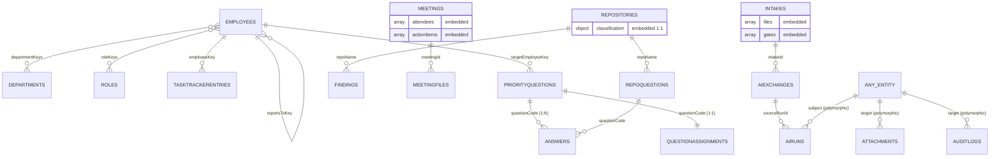

# Governance Workbench — MongoDB Version 1 Database Specification (APPROVED)

> **Status:** ✅ Approved for implementation · **Version:** 1.0 · **Supersedes for build purposes:** the
> scale-oriented parts of `MONGODB_ARCHITECTURE_BLUEPRINT.md`
> **Companions:** `MONGODB_ARCHITECTURE_BLUEPRINT.md` (long-term vision & rationale),
> `BLUEPRINT_REVIEW.md` (the review this spec implements)
> **This is the official V1 database design.** It is the single source of truth for the first
> implementation. **No application code, migration scripts, or MongoDB collections are created by this
> document** — it is a specification only.

---

## 0. What V1 is (and is not)

**V1 is a faithful, durable MongoDB model of the Governance Workbench *as it exists today*** — nothing
more. Every collection below maps to a feature, API route, or data store that is live in the current
app. The enterprise/scale machinery from the blueprint (multi-tenant infrastructure, AI vector/RAG
plane, a generalized workflow engine, an event/outbox backbone, deep IAM) is **explicitly deferred**
to §7 "Future Enhancements," each behind a concrete trigger.

### Decisions locked in from the approved review

| # | Decision | V1 choice |
|---|---|---|
| 1 | Scale posture | **Lean core** (18 collections mapping 1:1 to current features), not 35 |
| 2 | Company discriminator | **`companyKey: string`** (`"MView"`), not `tenantId: ObjectId` + `tenants` |
| 3 | Identity model | **Auth fields merged into `employees`**; no separate `users`; permissions are a **code constant**, not a collection |
| 4 | Governance corpus (`_GOVERNANCE/**`) | **Stays file-based in V1**; only `findings` (already relational + has an API) is a collection. `decisions`, `glossary`, playbooks stay parsed-from-markdown |
| 5 | AI plane | **`aiRuns` + `aiExchanges` only.** No embeddings, vector search, RAG, prompt-versioning, or summaries collections |
| 6 | Source of truth for migration | **GitHub markdown + bundled corpus is primary**; SQLite is secondary (it is ephemeral `/tmp` on Vercel) |
| 7 | References | **String natural keys** (`employeeKey`, `questionCode`, `repoName`) for entities that already have them — preserves legacy links, avoids ObjectId lookups during migration |
| 8 | Audit | **One `auditLogs`** collection (`category: SECURITY \| ACTIVITY`) + inline audit envelope. No separate `changeHistory`/`activityLogs` in V1 |

---

## 1. V1 Collection List (the complete set)

**18 collections.** Grouped by the current feature they serve.

| # | Collection | Serves (current feature / route) | Replaces (today's storage) |
|---|---|---|---|
| 1 | `employees` | Employees, team members, login identity | `TEAM_MEMBER_PROFILES` (config) + `team-member-*.md` + vestigial SQLite `users` |
| 2 | `roles` | Role-based access (foundational) | — (net-new; permissions are a code constant) |
| 3 | `departments` | `/api/departments`, department tags | `DEPARTMENT_ARCHITECTURE` (config) |
| 4 | `taskTrackerEntries` | `/api/task_tracker` | `Governance_Files/task_tracker/*.md` |
| 5 | `priorityQuestions` | `/api/questions`, `/api/priority_questions/generate`, team-member questions | `AI_GENERATED_PRIORITY_QUESTIONS.md` + SQLite `team_member_questions` |
| 6 | `answers` | `/api/priority_questions/answer`, member answers | `*_answers/*.md` + `_answered_qids.md` + SQLite `team_member_question_answers` |
| 7 | `questionAssignments` | `/api/question_assignment` | SQLite `question_assignment` |
| 8 | `repoQuestions` | `/api/repo_questions/**` | SQLite `repo_questions` |
| 9 | `meetings` | `/api/meetings/**` | SQLite `meetings` + `meeting_attendees` + `meeting_action_items` + `Meetings/*.md` |
| 10 | `meetingFiles` | Meeting uploads, notes, voice memos, `/api/audio` | `notes_file_path` + `_VOICE_MEMOS/*.webm` |
| 11 | `repositories` | `/api/inventory`, `/api/classification`, aspect groups | SQLite `repo_classification` (embedded) + `ASPECT_GROUP_RULES` |
| 12 | `findings` | `/api/findings`, `/api/repo_understanding` | SQLite `finding_reviews` + `repo_understanding` + `F-\d+` register |
| 13 | `intakes` | `/api/intake/**` (upload → AI review → gates) | SQLite `intake` + `intake_file` + `gate` + `workflow_event` + `link` |
| 14 | `aiRuns` | All Claude/OpenAI invocations & analyses | SQLite `ai_run` + `team_member_file_analysis` + `team_member_question_ai_run` |
| 15 | `aiExchanges` | `/api/exchanges`, intake challenge-loop | SQLite `ai_exchange` |
| 16 | `attachments` | `/api/files`, member file uploads | SQLite `team_member_files` |
| 17 | `auditLogs` | Audit trail + activity feed | SQLite `team_member_correspondence_log` + net-new audit |
| 18 | `settings` | `/api/openai_settings`, app settings | `openai_settings` + `local_settings.json` |

> `questionPackets` (export-packet feature) is modeled as an **optional embedded array on
> `answers`/tracked in `auditLogs`** in V1 to avoid a 19th collection; promote to its own collection
> only if packet history becomes a first-class feature (see §7).

---

## 2. Shared Conventions

### 2.1 Naming
- Collections: `camelCase`, plural. Fields: `camelCase`. Enum values: `UPPER_SNAKE`.
- Reference fields: string natural key `<entity>Key` (e.g. `employeeKey`) where a natural key exists;
  `<entity>Id: ObjectId` otherwise. Booleans: `is`/`has` prefix. Dates: BSON `Date` (UTC), `At` suffix.

### 2.2 The V1 base envelope (on every collection)

```jsonc
{
  "_id": ObjectId,
  "companyKey": "MView",            // string discriminator (indexed on every collection)

  "createdAt": Date,                // required, default now
  "createdBy": "ryan_cochran",      // employeeKey | "system" | "migration"  (string in V1)
  "updatedAt": Date,                // required, default now
  "updatedBy": "ryan_cochran",
  "isDeleted": false,               // soft-delete flag (default false)
  "deletedAt": null,                // Date | null
  "deletedBy": null,                // string | null
  "version": 1,                     // optimistic-concurrency counter

  "metadata": { }                   // optional open bag for forward-compatible fields
}
```

- Stamped automatically by a shared `BaseRepository`; feature code never writes these by hand.
- `createdBy`/`updatedBy` are **employeeKey strings** in V1 (identity is currently self-asserted). They
  become ObjectId user references only if/when a separate `users` collection is introduced (§7).
- **Dropped from the blueprint** for V1: `tenantId`, `schemaVersion`, `changeSource`, `Decimal128`,
  denormalized name snapshots as a rule, `tagIds`.

### 2.3 Enums (single source of truth — a code constant, mirrored into validators)

| Domain | Values |
|---|---|
| Priority | `LOW · MEDIUM · HIGH · URGENT` |
| Question status | `NEW · OPEN · ANSWERED · ACCEPTED · CLOSED` |
| Task status | `DRAFT · SUBMITTED · REVIEWED` |
| Approval / gate | `NOT_STARTED · PENDING · APPROVED · REJECTED` |
| Confidence | `LOW · MEDIUM · HIGH` |
| AI engine | `CLAUDE · OPENAI · HEURISTIC` |
| AI status | `PENDING · RUNNING · SUCCEEDED · FAILED` |
| Entity status | `ACTIVE · INACTIVE · OFFBOARDED` |
| Role key | `SUPER_ADMIN · ADMIN · MANAGER · EMPLOYEE · VIEWER` |
| Audit category | `SECURITY · ACTIVITY` |

### 2.4 Soft delete & lifecycle
Default reads add `{ isDeleted: false }` (enforced in the repository base). Delete = set the tombstone.
Hard delete is privileged and rare. No TTL on business data in V1; `auditLogs` retained per policy.

---

## 3. Collection Specifications

> Base envelope (§2.2) is implied on every collection. `req` = required, `opt` = optional.

### 3.1 `employees`
- **Purpose:** Team members + governance profile + login identity + role assignment.
- **Fields:**
  | Field | Type | Req | Default | Validation / Notes |
  |---|---|---|---|---|
  | `memberKey` | string | req | — | canonical slug (`"ajay_landge"`), **unique per company**; natural key everywhere |
  | `aliases` | string[] | opt | `[]` | alternate key forms (e.g. `"Ajay_Landge"`) — reconciles the two legacy formats |
  | `fullName` | string | req | — | `"Ajay Landge"` |
  | `email` | string | opt | — | validated pattern if present |
  | `title` | string | opt | — | role/title text |
  | `purpose` | string | opt | — | one-line summary |
  | `departmentKeys` | string[] | req | `[]` | → `departments.key` (M:N) |
  | `reportsToKey` | string | opt | — | → `employees.memberKey` (self-ref) |
  | `repoScopes` | string[] | opt | `[]` | repo names the member owns |
  | `status` | enum | req | `ACTIVE` | `ACTIVE·INACTIVE·OFFBOARDED` |
  | `profile` | object | opt | `{}` | embedded narrative (snapshot, priorities, workCompleted) from markdown |
  | `roleKeys` | string[] | req | `["EMPLOYEE"]` | → `roles.key` (RBAC) |
  | `auth` | object | opt | — | `{ passwordHash, lastLoginAt, failedLoginCount, mfaEnabled }` — present once login is enabled |
- **Relationships:** M:N `departments` (by key); self-ref `reportsToKey`; referenced by nearly every
  other collection via `employeeKey`/`createdBy`.
- **Indexes:** `{companyKey:1, memberKey:1}` **unique**; `{companyKey:1, departmentKeys:1}`;
  `{companyKey:1, status:1}`; text `{fullName, title, purpose}`.
- **Lifecycle:** offboarded members → `status: OFFBOARDED` (from the hardcoded removed-employees list).

### 3.2 `roles`
- **Purpose:** RBAC role definitions. Permissions themselves are a **code constant** (`module:action`
  keys), not a collection, in V1.
- **Fields:** `key` (enum, unique), `name` (req), `description` (opt), `permissionKeys: string[]` (req),
  `isSystem` (bool, default true for built-ins).
- **Indexes:** `{companyKey:1, key:1}` **unique**.
- **Seed:** the five system roles (§2.3). RBAC *storage* is V1; *enforcement* is soft-launched (§6.5).

### 3.3 `departments`
- **Purpose:** Org departments (`DATA_SCIENCE`, `MARKETING`, …) moved from config to data.
- **Fields:** `key` (string, unique per company), `name` (req), `description` (opt),
  `leadEmployeeKey` (opt), `parentKey` (opt, hierarchy), `repoScopes: string[]` (opt).
- **Indexes:** `{companyKey:1, key:1}` **unique**.

### 3.4 `taskTrackerEntries`
- **Purpose:** Periodic per-employee work logs.
- **Fields:**
  | Field | Type | Req | Default | Notes |
  |---|---|---|---|---|
  | `employeeKey` | string | req | — | → `employees.memberKey` |
  | `entryDate` | Date | req | — | work date (IST-aware, stored UTC) |
  | `title` | string | opt | `"Task Tracker"` | |
  | `bodyMarkdown` | string | opt | — | original free text (round-trippable) |
  | `sections` | array | opt | `[]` | embedded `[{heading, items:[…]}]` parsed from body |
  | `status` | enum | req | `SUBMITTED` | `DRAFT·SUBMITTED·REVIEWED` |
  | `githubRef` | object | opt | — | `{path, sha, commitUrl}` — reconciliation anchor |
- **Indexes:** `{companyKey:1, employeeKey:1, entryDate:-1}`; `{companyKey:1, entryDate:-1}`;
  text `{bodyMarkdown, title}`.

### 3.5 `priorityQuestions`
- **Purpose:** Priority questions posed to members (manual + AI-generated).
- **Fields:**
  | Field | Type | Req | Default | Notes |
  |---|---|---|---|---|
  | `questionCode` | string | req | — | `Q-AI-####` / code, **unique per company** (dedupe key) |
  | `normalizedTitle` | string | opt | — | indexed dedupe key (mirrors current title-normalization) |
  | `title` | string | opt | — | |
  | `bodyMarkdown` | string | req | — | question text |
  | `shortQuestion` | string | opt | — | |
  | `targetEmployeeKey` | string | opt | — | → `employees` |
  | `priority` | enum | req | `MEDIUM` | |
  | `status` | enum | req | `OPEN` | `NEW·OPEN·ANSWERED·ACCEPTED·CLOSED` |
  | `source` | enum | req | `MANUAL` | `MANUAL·AI_GENERATED·FILE·MEETING` |
  | `sourceRef` | object | opt | — | `{collection, id, section}` origin |
  | `generatedBy` | string | opt | — | `claude·openai·manual` |
  | `answerCount` | int | opt | `0` | rollup |
- **Indexes:** `{companyKey:1, questionCode:1}` **unique**; `{companyKey:1, normalizedTitle:1}`;
  `{companyKey:1, targetEmployeeKey:1, status:1}`; `{companyKey:1, priority:1, updatedAt:-1}`;
  text `{bodyMarkdown, title, shortQuestion}`.

### 3.6 `answers`
- **Purpose:** Answers to priority/repo questions (independently authored & accepted).
- **Fields:** `questionCode` (req → question), `questionKind` (`PRIORITY·REPO`), `answerMarkdown`
  (req), `answeredByKey` (→ employees), `answeredAt` (Date), `questionMatch` (`{strategy, confidence}`
  — **records how the link was derived**, because legacy answer files don't carry the qid),
  `acceptedByKey` (opt), `acceptedAt` (opt), `sourceFileId` (opt → attachments), `githubRef` (opt).
- **Indexes:** `{companyKey:1, questionCode:1, answeredAt:-1}`;
  `{companyKey:1, answeredByKey:1, answeredAt:-1}`.

### 3.7 `questionAssignments`
- **Purpose:** Ownership of a question.
- **Fields:** `questionCode` (req), `questionKind` (`PRIORITY·REPO`), `assigneeKey` (req → employees),
  `note` (opt).
- **Indexes:** `{companyKey:1, questionCode:1}` **unique**.

### 3.8 `repoQuestions`
- **Purpose:** Repository-scoped questions.
- **Fields:** `questionCode` (req, unique), `repoName` (req → repositories), `title`, `bodyMarkdown`
  (req), `shortQuestion`, `priority` (enum, `MEDIUM`), `status` (enum, `OPEN`), `source`, `sourceRef`,
  `sourceExcerpt`, `primaryAssigneeKey`, `answerMarkdown` (last accepted), `reviewNote`,
  `reviewedByKey`.
- **Indexes:** `{companyKey:1, questionCode:1}` **unique**; `{companyKey:1, repoName:1}`;
  `{companyKey:1, priority:1, updatedAt:-1}`; text `{bodyMarkdown, title}`.

### 3.9 `meetings`
- **Purpose:** Meetings with **embedded** attendees & action items.
- **Fields:**
  | Field | Type | Req | Default | Notes |
  |---|---|---|---|---|
  | `title` | string | req | — | |
  | `meetingType` | string | req | `other` | free label (`standup·review·governance·other`) |
  | `organizerKey` | string | opt | — | → employees |
  | `meetingAt` | Date | req | — | |
  | `note` | string | opt | — | |
  | `attendees` | array | opt | `[]` | **embedded** `[{employeeKey?, externalName?, externalEmail?, attended, followUpDone, followUpNote?}]` |
  | `actionItems` | array | opt | `[]` | **embedded** `[{ownerKey?, description, status, dueAt?}]` |
  | `summary` | object | opt | — | `{text, status, engine, generatedAt}` (AI summary snapshot) |
  | `priorityQuestionCodes` | string[] | opt | `[]` | questions generated from the meeting |
  | `fileIds` | ObjectId[] | opt | `[]` | → meetingFiles |
- **Indexes:** `{companyKey:1, meetingAt:-1}`; `{companyKey:1, "attendees.employeeKey":1}`;
  text `{title, note, "summary.text"}`.

### 3.10 `meetingFiles`
- **Purpose:** Meeting artifacts (notes, transcripts, voice memos).
- **Fields:** `meetingId` (req → meetings), `originalFilename`, `storageRef` (`{provider,bucket,key}`
  — **binaries live in object storage / GridFS, not the document**), `mimeType`, `sizeBytes`, `kind`
  (`NOTES·TRANSCRIPT·AUDIO·OTHER`), `transcriptText` (opt), `analysisRunId` (opt → aiRuns).
- **Indexes:** `{companyKey:1, meetingId:1}`.

### 3.11 `repositories`
- **Purpose:** Repository registry with **embedded classification** (strict 1:1 — no separate
  collection) and aspect-group membership.
- **Fields:** `name` (req, unique per company), `owner`, `defaultBranch`, `aspectGroup` (string),
  `departmentKeys: string[]`, `classification` (**embedded** `{observedPurpose, proposedCategory,
  confidence, canonicalStatus, evidence, approvalStatus (PENDING·APPROVED·REJECTED), findingCode?,
  questionCode?, updatedAt}`), `isArchived` (bool).
- **Indexes:** `{companyKey:1, name:1}` **unique**; `{companyKey:1, "classification.approvalStatus":1}`;
  `{companyKey:1, "classification.proposedCategory":1}`.

### 3.12 `findings`
- **Purpose:** Review findings / repo understanding (the `F-\d+` register + review decisions).
- **Fields:** `findingCode` (req, unique), `repoName` (opt → repositories), `departmentKey` (opt),
  `title`, `bodyMarkdown`, `severity` (opt), `status`/`decision` (`OPEN·REVIEWED·ACCEPTED·REJECTED`),
  `reviewerKey`, `reviewedAt`, `reviewNote`, `nextQuestionsNote`, `questionCode` (opt).
- **Indexes:** `{companyKey:1, findingCode:1}` **unique**; `{companyKey:1, repoName:1}`;
  `{companyKey:1, decision:1}`.

### 3.13 `intakes`
- **Purpose:** The intake pipeline (upload → AI review → gates → advance) — modeled as **one document
  with embedded files/links/gates**, not a generalized workflow engine.
- **Fields:**
  | Field | Type | Req | Default | Notes |
  |---|---|---|---|---|
  | `employeeKey` | string | opt | — | submitter |
  | `sourceType` | string | opt | — | |
  | `aiEngines` | string[] | opt | `[]` | `["claude","openai"]` |
  | `note` | string | opt | — | |
  | `stage` | string | req | `Uploaded` | current workflow stage (from `WORKFLOW_STAGES`) |
  | `blocker` | string | opt | — | |
  | `files` | array | opt | `[]` | embedded `[{filename, storageRef, sizeBytes}]` |
  | `links` | array | opt | `[]` | embedded `[{kind, ref}]` |
  | `gates` | array | opt | `[]` | embedded `[{name, status, approverKey?, decidedAt?, note?}]` |
  | `stageHistory` | array | opt | `[]` | embedded `[{stage, at, actorKey, note}]` (from `workflow_event`) |
- **Indexes:** `{companyKey:1, stage:1, updatedAt:-1}`; `{companyKey:1, employeeKey:1}`.

### 3.14 `aiRuns`
- **Purpose:** Uniform log of every Claude/OpenAI invocation & analysis.
- **Fields:** `engine` (`CLAUDE·OPENAI·HEURISTIC`), `model` (opt), `actionType`
  (`SUMMARY·ANALYSIS·GENERATE_QUESTIONS·PARSE_ANSWERS·CHAT·CLASSIFY·FOLLOW_UP`), `subject`
  (`{collection, id}` — what it acted on), `status` (`PENDING·RUNNING·SUCCEEDED·FAILED`), `startedAt`,
  `completedAt`, `promptText` (opt), `outputText` (opt), `outputStorageRef` (opt — offload large
  output), `errorText` (opt), `exchangeId` (opt → aiExchanges).
- **Indexes:** `{companyKey:1, "subject.collection":1, "subject.id":1, startedAt:-1}`;
  `{companyKey:1, engine:1, status:1}`; `{companyKey:1, startedAt:-1}`.

### 3.15 `aiExchanges`
- **Purpose:** The intake **challenge-loop** — two engines' outputs and their agreement state (kept as
  its own shape to preserve fidelity, per the review).
- **Fields:** `intakeId` (req → intakes), `topic`, `sourceEngine`, `targetEngine`, `status`,
  `sourceRunId` (→ aiRuns), `sourcePrompt`, `sourceOutput`, `targetPrompt`, `targetOutput`,
  `agreementStatus` (default `Needs review`), `nextAction` (default `Hold`), `errorText`.
- **Indexes:** `{companyKey:1, intakeId:1}`; `{companyKey:1, status:1, updatedAt:-1}`.

### 3.16 `attachments`
- **Purpose:** Generic file registry for any entity (member files, uploads, exports).
- **Fields:** `target` (`{collection, id}` polymorphic owner), `originalFilename`, `storageRef`
  (`{provider,bucket,key}`), `mimeType`, `sizeBytes`, `filePurpose` (string), `checksum` (opt —
  dedupe), `uploadedByKey`, `aiPreference` (`CLAUDE·OPENAI`, opt), `analysisRunIds: ObjectId[]` (opt).
- **Indexes:** `{companyKey:1, "target.collection":1, "target.id":1}`; `{companyKey:1, checksum:1}`.

### 3.17 `auditLogs`
- **Purpose:** Append-only audit trail **and** user-facing activity feed in one collection,
  distinguished by `category`. Replaces `team_member_correspondence_log` and adds security audit.
- **Fields:** `category` (`SECURITY·ACTIVITY`), `actorKey` (string), `action` (string), `verb` (opt —
  human-readable for activity), `target` (`{collection, id}`), `summary` (opt), `outcome`
  (`SUCCESS·DENIED·ERROR`, opt), `context` (object, opt), `at` (Date).
- **Indexes:** `{companyKey:1, at:-1}`; `{companyKey:1, "target.collection":1, "target.id":1, at:-1}`;
  `{companyKey:1, actorKey:1, at:-1}`; `{companyKey:1, category:1, at:-1}`.
- **Immutability:** append-only; the app DB user has no update/delete on this collection.

### 3.18 `settings`
- **Purpose:** App + integration settings (OpenAI model, GitHub config flags, feature toggles).
  Replaces `openai_settings` and `local_settings.json`.
- **Fields:** `scope` (`APP·USER`), `ownerKey` (companyKey or employeeKey), `key` (string),
  `value` (mixed), `isSecret` (bool — **secret values point to a secrets manager, never stored raw**).
- **Indexes:** `{companyKey:1, scope:1, ownerKey:1, key:1}` **unique**.

---

## 4. Relationships (V1)

### 4.1 Inventory

| Relationship | Type | Modeled as | Note |
|---|---|---|---|
| `employees` ↔ `departments` | M:N | `departmentKeys[]` (string) | Members span departments |
| `employees` → `employees` | 1:N self | `reportsToKey` | Reporting line |
| `employees` → `roles` | M:N | `roleKeys[]` | RBAC |
| `employees` → `taskTrackerEntries` | 1:N | `employeeKey` | Work log |
| `priorityQuestions` → `answers` | 1:N | `questionCode` | Answers over time |
| `priorityQuestions`/`repoQuestions` → `questionAssignments` | 1:1 | `questionCode` unique | Ownership |
| `repositories` → classification | 1:1 | **embedded** | Always co-read |
| `repositories` → `repoQuestions`/`findings` | 1:N | `repoName` | Repo-scoped |
| `meetings` → attendees / actionItems | 1:N | **embedded** | Bounded |
| `meetings` → `meetingFiles` | 1:N | `meetingId` | Binaries in object store |
| `intakes` → files / links / gates | 1:N | **embedded** | Bounded workflow doc |
| `intakes` → `aiExchanges` | 1:N | `intakeId` | Challenge loop |
| `aiExchanges` → `aiRuns` | 1:N | `sourceRunId` | Execution log |
| any entity → `aiRuns` | 1:N | polymorphic `subject` | AI history |
| any entity → `attachments` / `auditLogs` | 1:N | polymorphic `target` | Cross-cutting |

### 4.2 ER diagram (V1)



---

## 5. Index Summary (V1)

One unique natural-key index + the minimum query indexes per collection. Add more only when a slow
query is observed (Atlas Performance Advisor). All indexes are `companyKey`-prefixed.

| Collection | Indexes |
|---|---|
| `employees` | `{companyKey,memberKey}` **U** · `{companyKey,departmentKeys}` · `{companyKey,status}` · text `{fullName,title,purpose}` |
| `roles` | `{companyKey,key}` **U** |
| `departments` | `{companyKey,key}` **U** |
| `taskTrackerEntries` | `{companyKey,employeeKey,entryDate desc}` · `{companyKey,entryDate desc}` · text `{bodyMarkdown,title}` |
| `priorityQuestions` | `{companyKey,questionCode}` **U** · `{companyKey,normalizedTitle}` · `{companyKey,targetEmployeeKey,status}` · `{companyKey,priority,updatedAt desc}` · text |
| `answers` | `{companyKey,questionCode,answeredAt desc}` · `{companyKey,answeredByKey,answeredAt desc}` |
| `questionAssignments` | `{companyKey,questionCode}` **U** |
| `repoQuestions` | `{companyKey,questionCode}` **U** · `{companyKey,repoName}` · `{companyKey,priority,updatedAt desc}` · text |
| `meetings` | `{companyKey,meetingAt desc}` · `{companyKey,attendees.employeeKey}` · text |
| `meetingFiles` | `{companyKey,meetingId}` |
| `repositories` | `{companyKey,name}` **U** · `{companyKey,classification.approvalStatus}` · `{companyKey,classification.proposedCategory}` |
| `findings` | `{companyKey,findingCode}` **U** · `{companyKey,repoName}` · `{companyKey,decision}` |
| `intakes` | `{companyKey,stage,updatedAt desc}` · `{companyKey,employeeKey}` |
| `aiRuns` | `{companyKey,subject.collection,subject.id,startedAt desc}` · `{companyKey,engine,status}` · `{companyKey,startedAt desc}` |
| `aiExchanges` | `{companyKey,intakeId}` · `{companyKey,status,updatedAt desc}` |
| `attachments` | `{companyKey,target.collection,target.id}` · `{companyKey,checksum}` |
| `auditLogs` | `{companyKey,at desc}` · `{companyKey,target.collection,target.id,at desc}` · `{companyKey,actorKey,at desc}` · `{companyKey,category,at desc}` |
| `settings` | `{companyKey,scope,ownerKey,key}` **U** |

**U** = unique. Full-text search uses MongoDB **text indexes** in V1 (no Atlas Search / vector index).

---

## 6. Validation Rules (V1)

### 6.1 Two layers
1. **Edge:** Zod DTO validation in the service layer on every write.
2. **Database:** `$jsonSchema` validator per collection, `validationLevel: strict`,
   `validationAction: error`. Enums/constants come from the §2.3 source, mirrored into both.

### 6.2 Universal required fields
`companyKey`, `createdAt`, `createdBy`, `updatedAt`, `updatedBy`, `isDeleted`, `version` on every doc.

### 6.3 Per-collection key rules (representative)
- Uniqueness (enforced by unique index, not validators): `employees.memberKey`,
  `priorityQuestions.questionCode`, `repoQuestions.questionCode`, `repositories.name`,
  `findings.findingCode`, `departments.key`, `roles.key`, `questionAssignments.questionCode`.
- Enum membership: all `status`/`priority`/`engine`/`category`/`confidence`/`approvalStatus` fields.
- Format: `questionCode` matches `^Q-[A-Z0-9-]+$`; `findingCode` matches `^F-[0-9-]+$`; `email`
  pattern; non-empty `bodyMarkdown`/`fullName`; `answerCount` / `sizeBytes` `minimum: 0`.
- Referential (enforced in the repository layer — validators can't join): `answers.questionCode`
  resolves to a live question; `meetingFiles.meetingId`, `aiExchanges.intakeId`,
  `repoQuestions.repoName` resolve; `employeeKey` references resolve to a live employee.

### 6.4 Consistency
- **Transactions** wrap the few multi-collection writes (e.g. create question + assignment + audit).
- **Optimistic concurrency:** updates match `{_id, version}` and `$inc` version → `409` on conflict.
- **Rollup integrity:** `priorityQuestions.answerCount` maintained on answer create/delete; a periodic
  job reconciles drift and reports to `auditLogs`.

### 6.5 RBAC enforcement (soft-launch)
Roles/permissions are stored in V1. Enforcement is enabled after employee login adoption: seed one
credential per employee, keep the current employee-picker UX during transition, then turn the gate on.

---

## 7. Future Enhancements (explicitly NOT in V1)

Each is additive — none requires reworking a V1 collection. Build only when its trigger fires.

| Deferred item | Trigger to build | What it adds |
|---|---|---|
| `tenants` + ObjectId `tenantId` + tenant middleware | A **second company** onboards | Promote `companyKey` string → tenant refs; tenant-scoped middleware |
| Separate `users` + `sessions` + `apiKeys` | Non-employee accounts, SSO, or programmatic access | Split auth off `employees`; server-side sessions; API keys |
| `permissions` as a collection | Tenant-customizable permissions | Promote the code constant to data |
| `teams`, `projects` | A real people-team or project feature ships | People grouping; project rollups |
| `dailyTasks` board | Product decision to build the (currently vestigial) task board | Assignable to-dos, statuses, due dates |
| Workflow engine (`workflowDefinitions`/`workflowInstances`/`approvals`) | A **second** workflow beyond intake | Generalized stages/gates/approvals |
| AI plane: `embeddings`, `knowledgeBase`, vector index, RAG, `promptHistory`, `aiSummaries`/`aiDocuments` | A semantic-search / AI-assistant feature + a worker host + larger corpus | Vector search, RAG grounding, prompt versioning |
| Corpus ingestion (`decisions`, `glossary`, `securityRegister`, playbooks as collections) | Need to query/edit the corpus in-app rather than parse files | First-class governance-corpus collections |
| `changeHistory` (field-level) + separate `activityLogs` | Compliance/audit requires per-field diffs or feed volume grows | Point-in-time reconstruction; split feeds |
| `notifications` collection | An in-app notification feature ships | Notification feed |
| `emailQueue`, `outbox` + Change Streams + workers | A persistent worker host exists (not Vercel serverless) + outbound email/events | Reliable async fan-out |
| `reportSnapshots` + read replicas + Redis cache | Dashboards/analytics + measured read pressure | Precomputed analytics; caching |
| Sharding on `{companyKey: hashed}` | A collection outgrows a single shard | Horizontal scale |
| Field-level encryption (CSFLE) | Regulated PII/legal/finance data | Per-field encryption |
| `questionPackets` as its own collection | Packet history becomes first-class | Versioned export bundles |

---

## 8. API Mapping (V1)

Existing routes continue to work; internally they move to the layered `controller → service →
repository` path over the V1 collections. New REST endpoints are versioned under `/api/v1`.

| Feature | Current route(s) | V1 collection(s) | New REST (target) |
|---|---|---|---|
| Employees | `GET /api/employees`, `GET /api/team_members`, `GET /api/departments` | `employees`, `departments` | `GET/POST /api/v1/employees`, `GET/PATCH /api/v1/employees/:key`, `GET /api/v1/departments` |
| Task Tracker | `POST /api/task_tracker` | `taskTrackerEntries` | `GET/POST /api/v1/task-tracker`, `GET /api/v1/task-tracker/:id` |
| Priority Questions | `GET /api/questions`, `POST /api/priority_questions/generate` | `priorityQuestions` | `GET/POST /api/v1/priority-questions`, `POST /api/v1/priority-questions/generate` |
| Answers | `POST /api/priority_questions/answer` | `answers` | `POST /api/v1/priority-questions/:code/answers`, `GET .../answers` |
| Assignments | `GET/POST /api/question_assignment` | `questionAssignments` | `GET/PUT /api/v1/questions/:code/assignment` |
| Repo Questions | `GET /api/repo_questions`, `POST /api/repo_questions/{generate,update,chat}` | `repoQuestions`, `aiRuns` | `GET/POST /api/v1/repo-questions`, `POST .../:code/answer` |
| Meetings | `GET/POST /api/meetings`, `.../generate_summary`, `.../attendees/:key/follow_up` | `meetings`, `meetingFiles`, `aiRuns` | `GET/POST /api/v1/meetings`, `POST .../:id/summary`, `PATCH .../:id/attendees/:key/follow-up` |
| Meeting upload | `POST /api/meetings/analyze`, `POST /api/audio` | `meetingFiles`, `meetings` | `POST /api/v1/meetings/:id/files` |
| Classification / Repos | `GET /api/inventory`, `GET/POST /api/classification`, `GET/POST /api/aspect_groups` | `repositories` (embedded classification) | `GET /api/v1/repositories`, `GET/PATCH /api/v1/repositories/:name/classification` |
| Findings | `GET /api/findings`, `POST /api/findings/review`, `GET/POST /api/repo_understanding` | `findings` | `GET /api/v1/findings`, `POST /api/v1/findings/:code/review` |
| Intake workflow | `GET/POST /api/intake`, `.../{advance,gate,link,run_claude,run_openai,exchange}` | `intakes`, `aiRuns`, `aiExchanges` | `GET/POST /api/v1/intakes`, `POST .../:id/{advance,gate,exchange}` |
| AI exchanges | `GET /api/exchanges`, `POST /api/exchange/:id` | `aiExchanges`, `aiRuns` | `GET /api/v1/ai/exchanges`, `POST /api/v1/ai/exchanges/:id` |
| Files | `GET /api/files`, `POST /api/team_member_files`, `.../analyze` | `attachments`, `aiRuns` | `GET/POST /api/v1/attachments`, `POST .../:id/analyze` |
| Audit / activity | `GET /api/version_history`, correspondence log | `auditLogs` | `GET /api/v1/audit`, `GET /api/v1/:collection/:id/activity` |
| Settings | `GET/POST /api/openai_settings` | `settings` | `GET/PATCH /api/v1/settings` |

**Conventions:** JSON in/out; `GET/POST/PATCH/DELETE` (DELETE = soft delete); cursor pagination
(`?limit=&cursor=`); allow-listed filters/sort; `companyKey` derived server-side (never client-supplied);
error envelope `{code, message, details}`.

---

## 9. Sign-off

This document is the **approved Version 1 database specification** for the Governance Workbench
MongoDB migration. It defines the final collection list (18), relationships, indexes, validation
rules, and API mapping for the current application, with all enterprise-scale components deferred to
§7 behind concrete triggers.

**No implementation code, migration scripts, or MongoDB collections are created by this document.**
Implementation proceeds against this spec, from the GitHub-markdown-first source of truth, on the
`employees`/`roles`/`departments` foundation first, then feature by feature (Task Tracker → Priority
Q&A → Meetings → Repos/Findings → Intake/AI), each dual-run and verified before cutover, per the
roadmap in `MONGODB_ARCHITECTURE_BLUEPRINT.md` §18 (as adjusted by `BLUEPRINT_REVIEW.md` §9).
